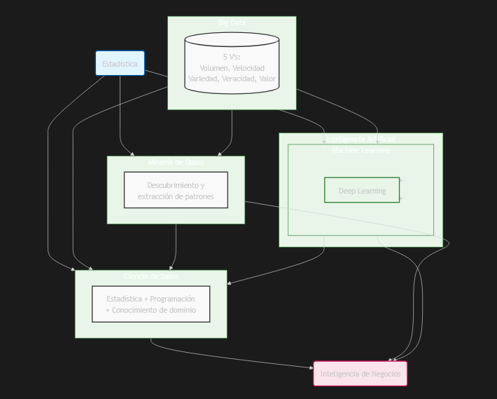
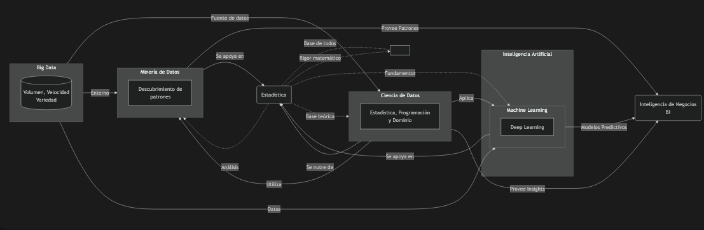
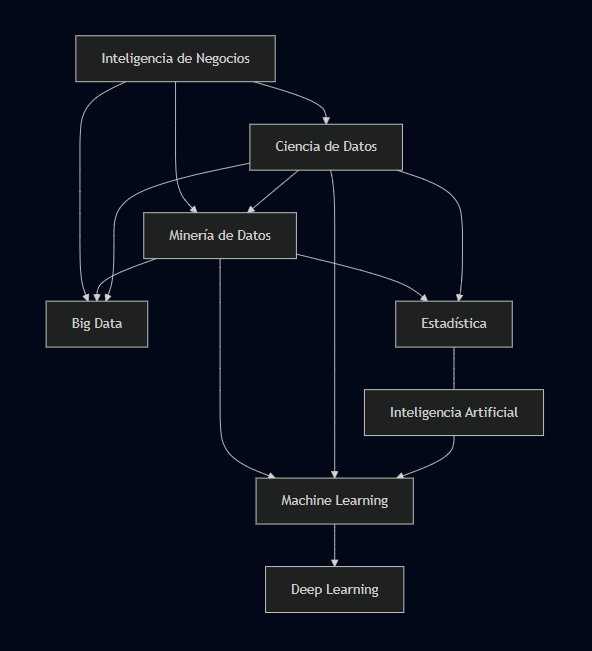
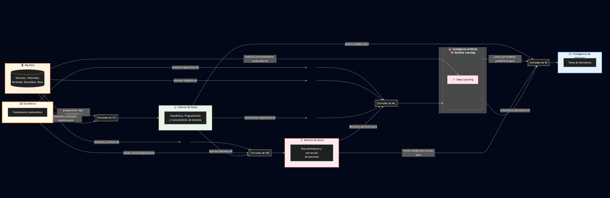
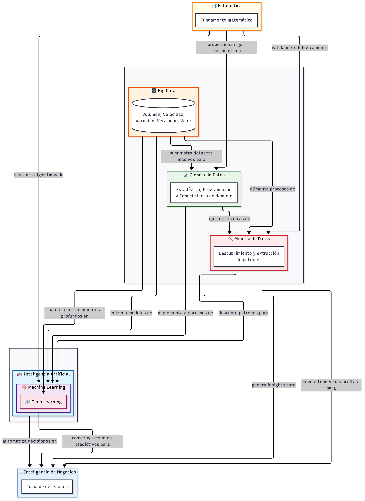

# Taller 1 – Introducción a Sistemas Inteligente - Prompts y Notas

## 1. Definiciones
### 1.1. Prompt usado
**Contexto:** Eres un profesor universitario de ciencia de datos e inteligencia artificial, reconocido por tu capacidad para explicar conceptos complejos de manera clara y accesible.

**Objetivo:** Redactar descripciones breves, precisas y didácticas de los siguientes términos técnicos, dirigidas a estudiantes con conocimientos básicos en tecnología, ciencia de datos y machine learning.

**Instrucciones específicas:**
-	Utiliza español.
-	Aplica negritas para resaltar las palabras clave más relevantes en cada descripción.
-	Cada concepto debe explicarse en un único párrafo conciso.
-	Mantén un tono didáctico y evita tecnicismos innecesarios.
-	Mantén las descripciones cortas y concisas (1 párrafo por término)

**Formato de salida:**
Lista numerada con cada término en negritas, seguido de su descripción breve.

### 1.2. Respuesta de ChatGPT (Resumen)

- **Big Data**: Conjunto de datos tan grandes y complejos que no pueden procesarse con herramientas tradicionales; caracterizado por volumen, velocidad y variedad.  
- **Machine Learning (ML)**: Rama de la IA que permite a los sistemas aprender patrones a partir de datos sin ser programados explícitamente.  
- **Inteligencia Artificial (IA)**: Disciplina que busca crear sistemas capaces de realizar tareas que requieren inteligencia humana.  
- **Ciencia de Datos (Data Science)**: Campo interdisciplinario que combina estadística, programación y conocimiento del dominio para extraer información valiosa.  
- **Deep Learning**: Subárea del ML que usa redes neuronales profundas para reconocer patrones complejos.  
- **Minería de Datos**: Proceso de explorar grandes bases de datos para descubrir patrones y tendencias.  
- **Inteligencia de Negocios (BI)**: Estrategias y herramientas que transforman datos en información útil para decisiones.  
- **Estadística**: Ciencia que organiza, analiza e interpreta datos para obtener conclusiones.  

**Referencias citadas por ChatGPT:**  
- Google: “What is Big Data?”  
- Wikipedia (Ciencia de Datos, Minería de Datos).  
- IBM: “What is Data Science?”, “Data science vs. machine learning”.  
- Artículo de AltexSoft: “Data Science, AI, ML, Deep Learning, and Data Mining …”  

### 1.3. Respuesta de DeepSeek (Resumen)
- **Big Data**: Conjuntos de datos extremadamente grandes, caracterizados por las 3 o 5 V’s (volumen, velocidad, variedad, veracidad, valor).  
- **Machine Learning**: Subdisciplina de la IA enfocada en sistemas que aprenden de datos y mejoran su desempeño sin ser programados explícitamente.  
- **Inteligencia Artificial**: Campo amplio de la informática que busca crear sistemas que realicen tareas humanas como aprender, razonar o comprender lenguaje natural.  
- **Ciencia de Datos**: Campo interdisciplinario que combina estadística, matemáticas, informática y conocimiento de dominio para extraer insights.  
- **Deep Learning**: Subcampo del ML que usa redes neuronales profundas inspiradas en el cerebro humano, muy útil en visión por computadora y NLP.  
- **Minería de Datos**: Proceso de analizar grandes conjuntos de datos para descubrir patrones y correlaciones.  
- **Inteligencia de Negocios (BI)**: Tecnologías y prácticas para recopilar, analizar y presentar información empresarial.  
- **Estadística**: Ciencia que recolecta, organiza e interpreta datos para probar hipótesis y cuantificar incertidumbre.

**Referencias citadas por DeepSeek:**  
- Big Data: O’Reilly Media (Mayer-Schönberger & Cukier), Gartner IT Glossary, IBM whitepapers.  
- Machine Learning: Mitchell (1997), Hastie, Tibshirani & Friedman (2009).  
- Inteligencia Artificial: Russell & Norvig (2020), Dartmouth proposal (1955).  
- Ciencia de Datos: Davenport & Patil (2012, HBR), Donoho (2017).  
- Deep Learning: Goodfellow et al. (2016), LeCun, Bengio & Hinton (2015).  
- Minería de Datos: Han, Kamber & Pei (2011), Fayyad et al. (1996).  
- Inteligencia de Negocios: Howson (2014), Inmon (2005).  
- Estadística: Walpole et al. (2012), Box et al. (2005).  

### 1.4. Notas personales  
- Utilicé dos LLMs: **ChatGPT (GPT-5)** y **DeepSeek (V3)**. Buscando verificar hechos con doble fuente y enriquecer la información.
- Comparando ambos LLMs: **ChatGPT** fue más conciso, mientras que **DeepSeek** fue más detallado y técnico.  
- En ambos casos pedí iteración para validar que no faltara nada esencial: ambos confirmaron y dieron pequeñas sugerencias de ampliación.  
- También pedí **referencias** en las iteraciones: ChatGPT brindó referencias más generales (Wikipedia, IBM, artículos divulgativos), mientras que DeepSeek brindó referencias académicas y libros estándar (Russell & Norvig, Goodfellow, Mitchell, etc.), lo que da mayor **rigor académico**.
- Curiosamente ante la trivialidad del concepto, respondieron hasta con las mismas palabras en algunos casos en la definición de cada uno de los elementos.
- Para el **PDF final**, voy a redactar definiciones más pulidas combinando lo breve de ChatGPT con lo profundo de DeepSeek, seleccionando la mayor calidad de referencias brindadas.

---

## 2. Definiciones
### 2.1. Prompt usado
**Contexto:** Eres un arquitecto de información y experto en ciencia de datos con 15 años de experiencia. Debes crear un diagrama de relaciones conceptuales para una audiencia con conocimientos básicos en tecnología, que incluya los 8 conceptos clave del área.

**Objetivo:** Generar un diagrama que muestre de manera precisa y visualmente clara las relaciones jerárquicas y de dependencia entre los siguientes conceptos (con sus definiciones proporcionadas anteriormente):
- Big Data
- Machine Learning
- Inteligencia Artificial
- Ciencia de Datos
- Deep Learning
- Minería de Datos
- Inteligencia de Negocios
- Estadística

**Instrucciones específicas:**
- Relaciones jerárquicas: Mustra claramente qué conceptos son subcampos de otros (ej: Deep Learning ⊂ Machine Learning ⊂ Inteligencia Artificial).
- Dependencias: Indica qué áreas dependen de otras para su funcionamiento (ej: Ciencia de Datos depende de Estadística).
- Claridad visual:
    - Usa subgraphs para agrupar conceptos relacionados.
    - Aplica colores diferenciados para cada categoría conceptual.
    - Mantén las etiquetas en español.
    - Evita el cruce excesivo de líneas.

**Formato de salida:**
Código del diagrama con Mermaid.js

### 2.2. Manejo de respuestas (LLMs) y refinamiento de diagrama.
1. DeepSeek fue quien, en un inicio, brindó resultados más apropiados en comparación con ChatGPT. Al realizar el primer prompt, me entregó un diagrama con todos los componentes, aunque con verbos en las relaciones poco significativos y un orden bastante desorganizado.

    

2. Posteriormente, le pedí que lo organizara utilizando colores y texto más descriptivo sobre cada componente. Sin embargo, después de varios intentos nunca logró producir un buen resultado, ya que parece no saber cómo manejar colores con Mermaid.js, generando constantemente errores de sintaxis. En un punto incluso perdió el contexto, entregando un diagrama más atractivo y organizado, pero sin detallar adecuadamente el texto de las relaciones.

    

3. Finalmente, decidí dejar de lado los colores y, pasándole nuevamente el texto de la primera sección, logró generar un resultado mucho más preciso.

    

4. Decidí probar con ChatGPT. El primer resultado fue el mostrado en la imagen: un diagrama muy pobre, por lo que opté por utilizar lo generado por DeepSeek como base para los pasos posteriores.

    

5. Una vez partiendo de la base de DeepSeek, parece ser que ChatGPT sí sabía utilizar correctamente los colores para mejorar el estilo del diagrama. No obstante, algunos elementos se sobreponían entre sí y el resultado final no representaba del todo el orden que buscaba.

    

6. Finalmente, acudí a Cloud, dado que había escuchado que era bueno para este tipo de tareas. Este organizó el diagrama con una estructura flexible más adecuada, definió mejor las relaciones entre componentes (tal como le había solicitado anteriormente) y me entregó el diagrama final.

    

### 2.3. Notas personales.
- En definitiva, el potencial de iterar y utilizar diferentes LLMs permite aprovechar las capacidades únicas de cada uno, según lo que se busca.
- Fue un proceso largo, ya que tuve que lidiar con DeepSeek, que no interpretaba correctamente la sintaxis. Sin embargo, considero que el resultado final fue excelente.
- Nuevamente, destaco la importancia de combinar distintos LLMs para obtener resultados más precisos.