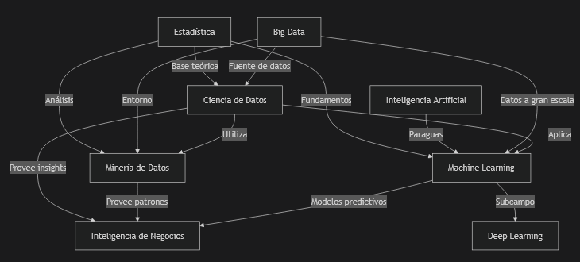

# Taller 1 – Introducción a Sistemas Inteligente - Prompts y Notas

## 1. Definiciones
### 1.1. Prompt usado
**Contexto:** Eres un profesor universitario de ciencia de datos e inteligencia artificial, reconocido por tu capacidad para explicar conceptos complejos de manera clara y accesible.

**Objetivo:** Redactar descripciones breves, precisas y didácticas de los siguientes términos técnicos, dirigidas a estudiantes con conocimientos básicos en tecnología, ciencia de datos y machine learning.

**Instrucciones específicas:**
-	Utiliza español.
-	Aplica negritas para resaltar las palabras clave más relevantes en cada descripción.
-	Cada concepto debe explicarse en un único párrafo conciso.
-	Mantén un tono didáctico y evita tecnicismos innecesarios.
-	Mantén las descripciones cortas y concisas (1 párrafo por término)

**Formato de salida:**
Lista numerada con cada término en negritas, seguido de su descripción breve.

### 1.2. Respuesta de ChatGPT (Resumen)

- **Big Data**: Conjunto de datos tan grandes y complejos que no pueden procesarse con herramientas tradicionales; caracterizado por volumen, velocidad y variedad.  
- **Machine Learning (ML)**: Rama de la IA que permite a los sistemas aprender patrones a partir de datos sin ser programados explícitamente.  
- **Inteligencia Artificial (IA)**: Disciplina que busca crear sistemas capaces de realizar tareas que requieren inteligencia humana.  
- **Ciencia de Datos (Data Science)**: Campo interdisciplinario que combina estadística, programación y conocimiento del dominio para extraer información valiosa.  
- **Deep Learning**: Subárea del ML que usa redes neuronales profundas para reconocer patrones complejos.  
- **Minería de Datos**: Proceso de explorar grandes bases de datos para descubrir patrones y tendencias.  
- **Inteligencia de Negocios (BI)**: Estrategias y herramientas que transforman datos en información útil para decisiones.  
- **Estadística**: Ciencia que organiza, analiza e interpreta datos para obtener conclusiones.  

### 1.3. Respuesta de DeepSeek (Resumen)
- **Big Data**: Conjuntos de datos extremadamente grandes, caracterizados por las 3 o 5 V’s (volumen, velocidad, variedad, veracidad, valor).  
- **Machine Learning**: Subdisciplina de la IA enfocada en sistemas que aprenden de datos y mejoran su desempeño sin ser programados explícitamente.  
- **Inteligencia Artificial**: Campo amplio de la informática que busca crear sistemas que realicen tareas humanas como aprender, razonar o comprender lenguaje natural.  
- **Ciencia de Datos**: Campo interdisciplinario que combina estadística, matemáticas, informática y conocimiento de dominio para extraer insights.  
- **Deep Learning**: Subcampo del ML que usa redes neuronales profundas inspiradas en el cerebro humano, muy útil en visión por computadora y NLP.  
- **Minería de Datos**: Proceso de analizar grandes conjuntos de datos para descubrir patrones y correlaciones.  
- **Inteligencia de Negocios (BI)**: Tecnologías y prácticas para recopilar, analizar y presentar información empresarial.  
- **Estadística**: Ciencia que recolecta, organiza e interpreta datos para probar hipótesis y cuantificar incertidumbre.

### 1.4. Notas personales  
- Utilicé dos LLMs: **ChatGPT (GPT-5)** y **DeepSeek (V3)**. Buscando verificar hechos con doble fuente y enriquecer la información.
- Comparando ambos LLMs: **ChatGPT** fue más conciso, mientras que **DeepSeek** fue más detallado y técnico.  
- En ambos casos pedí iteración para validar que no faltara nada esencial: ambos confirmaron y dieron pequeñas sugerencias de ampliación.  
- También pedí **referencias** en las iteraciones: ChatGPT brindó referencias más generales (Wikipedia, IBM, artículos divulgativos), mientras que DeepSeek brindó referencias académicas y libros estándar (Russell & Norvig, Goodfellow, Mitchell, etc.), lo que da mayor **rigor académico**.
- Curiosamente ante la trivialidad del concepto, respondieron hasta con las mismas palabras en algunos casos en la definición de cada uno de los elementos.
- Para el **PDF final**, voy a redactar definiciones más pulidas combinando lo breve de ChatGPT con lo profundo de DeepSeek, seleccionando la mayor calidad de referencias brindadas.

---

## 2. Diagrama de relación entre conceptos con Mermaid.js
### 2.1. Prompt usado
**Contexto:** Eres un arquitecto de información y experto en ciencia de datos con 15 años de experiencia. Debes crear un diagrama de relaciones conceptuales para una audiencia con conocimientos básicos en tecnología, que incluya los 8 conceptos clave del área.

**Objetivo:** Generar un diagrama que muestre de manera precisa y visualmente clara las relaciones jerárquicas y de dependencia entre los siguientes conceptos (con sus definiciones proporcionadas anteriormente):
- Big Data
- Machine Learning
- Inteligencia Artificial
- Ciencia de Datos
- Deep Learning
- Minería de Datos
- Inteligencia de Negocios
- Estadística

**Instrucciones específicas:**
- Relaciones jerárquicas: Mustra claramente qué conceptos son subcampos de otros (ej: Deep Learning ⊂ Machine Learning ⊂ Inteligencia Artificial).
- Dependencias: Indica qué áreas dependen de otras para su funcionamiento (ej: Ciencia de Datos depende de Estadística).
- Claridad visual:
    - Usa subgraphs para agrupar conceptos relacionados.
    - Aplica colores diferenciados para cada categoría conceptual.
    - Mantén las etiquetas en español.
    - Evita el cruce excesivo de líneas.

**Formato de salida:**
Código del diagrama con Mermaid.js

### 2.2. Manejo de respuestas (LLMs) y refinamiento de diagrama.
1. DeepSeek fue quien, en un inicio, brindó resultados más apropiados en comparación con ChatGPT. Al realizar el primer prompt, me entregó un diagrama con todos los componentes, aunque con verbos en las relaciones poco significativos y un orden bastante desorganizado.

    

2. Posteriormente, le pedí que lo organizara utilizando colores y texto más descriptivo sobre cada componente. Sin embargo, después de varios intentos nunca logró producir un buen resultado, ya que parece no saber cómo manejar colores con Mermaid.js, generando constantemente errores de sintaxis. En un punto incluso perdió el contexto, entregando un diagrama más atractivo y organizado, pero sin detallar adecuadamente el texto de las relaciones.

    

3. Finalmente, decidí dejar de lado los colores y, pasándole nuevamente el texto de la primera sección, logró generar un resultado mucho más preciso.

    

4. Decidí probar con ChatGPT. El primer resultado fue el mostrado en la imagen: un diagrama muy pobre, por lo que opté por utilizar lo generado por DeepSeek como base para los pasos posteriores.

    

5. Una vez partiendo de la base de DeepSeek, parece ser que ChatGPT sí sabía utilizar correctamente los colores para mejorar el estilo del diagrama. No obstante, algunos elementos se sobreponían entre sí y el resultado final no representaba del todo el orden que buscaba.

    

6. Finalmente, acudí a Cloud, dado que había escuchado que era bueno para este tipo de tareas. Este organizó el diagrama con una estructura flexible más adecuada, definió mejor las relaciones entre componentes (tal como le había solicitado anteriormente) y me entregó el diagrama final.

    

### 2.3. Notas personales
- En definitiva, el potencial de iterar y utilizar diferentes LLMs permite aprovechar las capacidades únicas de cada uno, según lo que se busca.
- Fue un proceso largo, ya que tuve que lidiar con DeepSeek, que no interpretaba correctamente la sintaxis. Sin embargo, considero que el resultado final fue excelente.
- Nuevamente, destaco la importancia de combinar distintos LLMs para obtener resultados más precisos.

## 3. Video reciente con aplicación interesante de IA.
### 3.1. Prompt usado
**Contexto:** Eres un estudiante al que se le ha encargado buscar un video sobre una aplicación de inteligencia artificial que sea interesante. Encuentras un blog de NVIDIA que presenta una aplicación de IA multimodal para buscar dentro de un video y generar resúmenes automáticos (https://developer.nvidia.com/blog/build-a-video-search-and-summarization-agent-with-nvidia-ai-blueprint/?utm_source=chatgpt.com
).

**Objetivo:** Escribir una síntesis breve y clara sobre el contenido del video, destacando su funcionamiento, utilidad y relevancia.

**Instrucciones específicas:**
- Utiliza español.
- Explica en qué consiste la aplicación.
- Señala qué problema soluciona o qué necesidad cubre.

**Formato de salida:**
Un párrafo en español, escrito en estilo académico, que resuma lo más relevante del blog y el video de forma clara y completa.

### 3.2. Respuesta ChatGPT (RESUMEN)
El video de NVIDIA presenta una aplicación de **inteligencia artificial multimodal** que combina visión por computador y modelos de lenguaje para realizar búsquedas dentro de un video y generar resúmenes automáticos. El sistema extrae fotogramas clave y transcripciones, los procesa mediante un **modelo de lenguaje grande (LLM)** y responde a consultas en lenguaje natural, localizando y resumiendo segmentos relevantes. Esto resulta valioso porque **soluciona el problema del tiempo y esfuerzo que implica revisar manualmente contenido audiovisual extenso**, facilitando el acceso rápido a la información esencial.  

### 3.3. Notas personales
- Dado que el trabajo se ha basado en el uso de LLMs, busqué escribir un resumen con mis palabras y luego compararlo con el de ChatGPT, determinando que realmente si menciona todos los temas mas relevantes a tratar sobre el mismo, el cual no es muy largo.
- Complementé lo del LLM con mis notas sobre el PDF final.

## 4. ¿Qué son los Transformers?
### 4.1. Prompt usado
**Contexto:** Eres un investigador en ciencia de datos que debe explicar el concepto de transformers en inteligencia artificial, basándote en el artículo seminal "Attention Is All You Need" y desarrollos posteriores.

**Objetivo:** Generar una explicación completa sobre transformers que cubra: a) ideas principales de funcionamiento, b) aplicaciones principales, c) relación con grandes modelos de lenguaje (LLMs), y d) proceso de entrenamiento de LLMs conversacionales.

**Instrucciones específicas:**
- Utiliza español académico pero accesible
- Incluye los cuatro componentes solicitados (a-d)
- Cita las referencias clave apropiadas para cada sección
- Mantén el formato de listas y sublistas para mejor organización
- Usa negritas para términos técnicos importantes

**Formato de salida:**
Documento en español con secciones claramente identificadas, usando listas anidadas donde sea apropiado, y con referencias bibliográficas al final.

### 4.2. Respuesta ChatGPT (RESUMEN)
Los transformers son una arquitectura de red neuronal revolucionaria introducida por Vaswani et al. en 2017 que reemplazó las RNN y CNN en procesamiento de secuencias. Su funcionamiento se basa en el mecanismo de atención autoasistida que permite procesar todas las posiciones de una secuencia simultáneamente, capturando dependencias de largo alcance mediante atención multi-cabeza. Las aplicaciones abarcan desde procesamiento de lenguaje natural y visión por computadora hasta bioinformática y sistemas de recomendación. Los grandes modelos de lenguaje (LLMs) como GPT y BERT escalan esta arquitectura con billones de parámetros, adquiriendo capacidades emergentes. El entrenamiento de LLMs conversacionales involucra pre-entrenamiento no supervisado, fine-tuning supervisado y alineamiento con preferencias humanas (RLHF) mediante técnicas como PPO y DPO.

### 4.3. Notas personales
- El video de YouTube "Transformers, explained: Understand the model behind GPT, BERT, and T5" (https://www.youtube.com/watch?v=aL-EmKuB078) proporciona una excelente explicación visual del mecanismo de atención y la arquitectura encoder-decoder, complementando perfectamente la explicación teórica brindada por el modelo de lenguaje.
- Dado que ya habia verificado con el video el conocimiento, preferí unicamente verificar con un único LLM y tener en cuenta las referencias que el mismo me brindaba.

## 5. Resolución de problemas de programación con LLM

### 5.1. Ejercicio 1: Votación
#### Prompt usado
**Contexto:** Soy estudiante y debo resolver un problema de programación en Python. El enunciado consiste en leer una lista de votos, contabilizarlos y determinar el ganador. Si existe empate, debe imprimirse la palabra `EMPATE`.  (Adjunté imagen de todo el ejercicio de la plataforma)

**Objetivo:** Generar un programa en Python 3.9 que use estructuras simples (diccionarios y condicionales) y que funcione en UNCode según lo que observas en la imagen.

**Instrucciones específicas:**
- El código debe ser de 9–16 líneas máximo.
- Usar `input()` para la entrada y `print()` para la salida.
- Detectar empates correctamente.
- Toma como referencia el ejemplo evidenciado en la imagen sobre entrada y salida.

#### Respuesta ChatGPT
ChatGPT-5 me propuso un código basado en un diccionario para almacenar los votos, calcular el máximo de votos y decidir si imprimir un nombre o la palabra `EMPATE`. El código era claro y funcionó a la primera sin necesidad de modificaciones.

#### Notas personales
- Este fue el ejercicio más directo, la solución era inmediata y obtuve **100% de aciertos** desde el primer intento.  
- Aprendí que el uso de `dict.get(clave, 0)` simplifica mucho la acumulación de votos. Habitualmente conocía otras formas de acceder a esto en diccionarios.
- El amplio contexto de la plataforma permite al LLM generar resultados precisos.
- No necesariamente debo estar totalmente alineado con la sintáxis del lenguaje, pues con conocimientos desde la lógica y el LLM se puede llegar a los resultados que se quieran.
---

### 5.2. Ejercicio 2: Semejanza de textos
#### Prompt usado
**Contexto:** El ejercicio pide leer dos frases y calcular: (1) cuántas palabras tienen en común, y (2) cuántas palabras únicas existen entre ambas.

**Objetivo:** Escribir un programa corto en Python que procese los textos como conjuntos y calcule las métricas, teniendo como referencia lo definido también en la imagen.

**Instrucciones específicas:**
- Usar operaciones de conjuntos (`&`, `^`, `|`).
- Imprimir dos líneas: primero compartidas, luego únicas.
- Toma como referencia el ejemplo evidenciado en la imagen sobre entrada y salida.

#### Respuesta ChatGPT
ChatGPT-5 me propuso primero una solución usando intersección y unión. Esto me dio resultados incorrectos porque la consigna pedía palabras **únicas** (diferencia simétrica) y no todo el vocabulario total. Tras mostrarle el error y revisar con él, me sugirió la versión corregida con `A ^ B`.

#### Iteración
Sí, este fue el único ejercicio en el que necesité **iterar**. Con la primera respuesta tuve un puntaje bajo, pero luego de la corrección obtuve el **100%**.  

#### Notas personales
- Fue útil descubrir en sintáxis como hacer una diferencia simétrica (`^`).
- Este error me sirvió para reforzar mi comprensión de teoría de conjuntos aplicada en Python.  
- No necesariamente debo estar totalmente alineado con la sintáxis del lenguaje, pues con conocimientos desde la lógica y el LLM se puede llegar a los resultados que se quieran.

---

### 5.3. Ejercicio 3: Producto punto
#### Prompt usado
**Contexto:** El ejercicio consistía en calcular el producto punto entre dos vectores de la misma dimensión.

**Objetivo:** Escribir un programa en Python 3.9 que lea dos listas de enteros y calcule su producto escalar.

**Instrucciones específicas:**
- Utilizar lectura con `input()` y conversión con `map(int, ...)`.
- Implementar el cálculo en pocas líneas, preferiblemente con `zip`.

#### Respuesta ChatGPT
ChatGPT-5 propuso una solución compacta usando comprensión con `sum(u*v for u,v in zip(...))`. El código fue correcto desde el inicio y pasó todos los casos.

#### Notas personales
- Este ejercicio también fue trivial y obtuve **100% en el primer intento**.  
- No necesariamente debo estar totalmente alineado con la sintáxis del lenguaje, pues con conocimientos desde la lógica y el LLM se puede llegar a los resultados que se quieran.

---

### 5.4. Reflexión general
- Los tres ejercicios fueron relativamente sencillos y representaban aplicaciones básicas de diccionarios, conjuntos y álgebra lineal en Python.  
- El apoyo de **ChatGPT-5** permitió obtener soluciones rápidas, correctas y bien explicadas.  
- El único caso donde necesité iterar fue en el ejercicio 2 (Semejanza de textos), lo cual me ayudó a comprender mejor el problema y a aprender de la corrección.  
- En todos los casos finales, logré **100% de éxito en UNCode**, con evidencia capturada en imágenes.  
