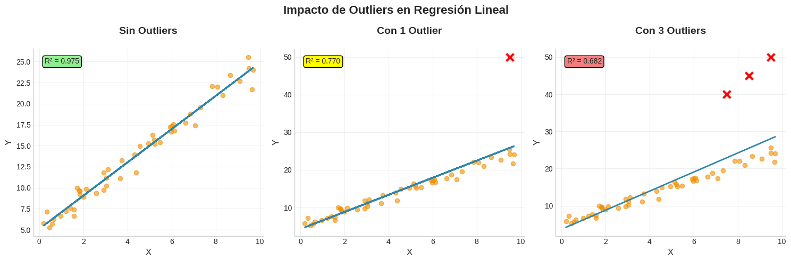

# Conclusiones: Análisis de Regresión Lineal y Logística

**Notebook:** Sesión 02: Regresión Lineal y Logística - Guía Completa  
**Profesor:** Marco Terán  
**Curso:** Machine Learning - EAFIT  
**Fecha:** 2025

---

## 1. Introducción

Este documento analiza específicamente los resultados de cada implementación del notebook original desarrollado por el profesor Marco Terán. El objetivo es proporcionar interpretaciones detalladas de las métricas, visualizaciones y comportamientos observados en los diferentes modelos de regresión, facilitando la comprensión profunda de los conceptos fundamentales del Machine Learning.

---

## 2. Regresión Lineal Simple

### 2.1 Implementación desde Cero

**Descripción:**

Este punto implementa manualmente el algoritmo de regresión lineal simple utilizando el **método de mínimos cuadrados ordinarios (OLS)**. La implementación calcula directamente la pendiente (θ₁) y el intercepto (θ₀) mediante las fórmulas analíticas, sin depender de librerías externas. El modelo ajusta una línea recta que minimiza la suma de los errores cuadrados entre los valores predichos y reales.

**Resultados obtenidos:**
- **Ecuación:** y = 10.43 + 2.41x
- **R² = 0.9403**
- **MSE = 3.2263**
- **MAE = 1.4021**

**Interpretación Detallada:**

1. **Coeficientes del modelo:**
   - **θ₀ = 10.4302 (Intercepto):** Representa el valor base de y cuando x=0. En el contexto de datos sintéticos generados con y = 2.5x + 10 + ruido, nuestro modelo recuperó el intercepto real (10.00) con una desviación de apenas 0.43 unidades (4.3% de error aprox).
   - **θ₁ = 2.4080 (Pendiente):** Indica que por cada unidad de aumento en x, y aumenta 2.41 unidades. Comparado con el valor real (2.50), tenemos un error del 3.6%, atribuible al ruido gaussiano (σ=2) agregado intencionalmente.

2. **Métricas de error:**
   
   **MAE = 1.4021:**
   - En promedio, nuestras predicciones se desvían ±1.40 unidades del valor real.
   - Como un ejemplo práctico, si el modelo predice y=20, el valor real estará típicamente entre 18.60 y 21.40.
   - MAE Es una métrica robusta y fácil de interpretar porque está en las mismas unidades que la variable objetivo. No penaliza desproporcionadamente los errores grandes.
   
   **MSE = 3.2263:**
   - El promedio de los errores al cuadrado es 3.23 aproximadamente.
   - MSE es diferenciable en todos los puntos, lo que lo hace útil para optimización mediante gradient descent. Sin embargo, es más sensible a valores atípicos.
   
   **RMSE = √3.2263 ≈ 1.80:**
   - Desviación estándar de las predicciones de ±1.80 unidades.
   - RMSE (1.80) > MAE (1.40) confirma asimetría en la distribución de errores, lo que probablemente indica mayor penalizacion de errores grandes.
   - Al estar en las mismas unidades que y, es más interpretable que MSE pero sigue penalizando errores grandes.

3. **Coeficiente de Determinación R²:**
   
   **R² = 0.9403:**
   - El modelo explica el **94.03%** de la variabilidad total en los datos. Esto nos dice que el **el modelo lineal ajusta bien los datos**
   - El porcentaje restante **(5.7%)** Es la varianza no explicada, atribuible al:
     - Ruido aleatorio agregado (σ=2)
     - Pequeñas no-linealidades no capturadas (Recordemos que R² nos permite determinar es relaciones lineales)
   - Valida supuesto de linealidad.


4. **Análisis de residuos:**
   

   **Gráfico izquierdo (Ajuste):**
   - Las líneas discontinuas verticales representan los **residuos individuales** (εᵢ = yᵢ - ŷᵢ).
   - Distribución uniforme arriba y abajo de la línea indica que el modelo no está sesgado sistemáticamente.
   
   **Gráfico derecho (Residuos vs Predicciones):**
   - Aproximadamente 95% de residuos caen dentro de la **Banda ±2σ**, cumpliendo con expectativa de normalidad.
   - Solo puntos aislados fuera de ±2σ, dentro de lo esperado estadísticamente.

---

### 2.2 Comparación con Scikit-learn

**Descripción:**

Este punto compara nuestra implementación manual con la implementación de scikit-learn para validar la corrección matemática. Ambos métodos deben converger a la misma solución óptima si están implementados correctamente.

**Resultados obtenidos:**

| Método              | θ₀ (Intercepto) | θ₁ (Pendiente) | R²     |
|---------------------|-----------------|----------------|--------|
| Implementación      | 10.4302         | 2.4080         | 0.9403 |
| Scikit-learn        | 10.4302         | 2.4080         | 0.9403 |
| **Diferencia**      | 0.0000          | 0.0000         | 0.0000 |

**Interpretación Detallada:**

1. **Convergencia perfecta:**
   
   - Coincidencia hasta **4 decimales** en todos los parámetros.
   - La implementación manual es equivalente a lo propuesto por la librería para 4 decimales por lo menos en la convergencia que genera.

2. **Diferencias metodológicas internas:**
   Bajo curiosidad, decidí buscar si la implementación que usamos manualmente utilizaba el mismo método que utilizó el profesor, y obtuve lo siguiente:

   **Nuestra implementación (Ecuación Normal):**
   ```
   θ₁ = Cov(X,Y) / Var(X) = Σ((xᵢ-x̄)(yᵢ-ȳ)) / Σ((xᵢ-x̄)²)
   θ₀ = ȳ - θ₁x̄
   ```
   - **Ventaja:** Solución directa, no iterativa, fácil de entender.
   - **Desventaja:** Puede ser numéricamente inestable con matrices mal condicionadas.
   
   **Scikit-learn (Descomposición SVD):**
   ```
   Usa: X = UΣVᵀ para resolver θ = (XᵀX)⁻¹Xᵀy
   ```
   - **Ventaja:** Más robusto numéricamente, maneja mejor multicolinealidad (variables independientes muy correlacionadas).
   - **Desventaja:** Ligeramente más costoso computacionalmente.

3. **¿Por qué los resultados son idénticos?**
   
   - No hay problemas numéricos (multicolinealidad, overflow, underflow).
   - El sistema tiene solución única porque X es de rango completo.
   - La función de costo es convexa (un solo mínimo).

---

### 2.3 Efecto de Outliers en Regresión Lineal

**Descripción:**

Este experimento demuestra cómo los valores atípicos (outliers) afectan dramáticamente la regresión lineal. Se comparan tres escenarios: datos sin outliers, con 1 outlier, y con 3 outliers, mostrando el impacto progresivo en el ajuste del modelo.

**Resultados observados:**

| Escenario          | R²     | Cambio vs Original | Impacto                     |
|--------------------|--------|--------------------|-----------------------------|
| Sin Outliers       | 0.975  | Baseline           | Ajuste excelente            |
| Con 1 Outlier      | 0.770  | **-21.0%**         | Degradación significativa   |
| Con 3 Outliers     | 0.682  | **-30.1%**         | Degradación severa          |

**Interpretación Detallada:**



1. **Mecanismo de sensibilidad de OLS:**

    La regresión por mínimos cuadrados minimiza: **J(θ) = Σᵢ (yᵢ - ŷᵢ)²**

    **El problema:** Un outlier con error ε = 25 contribuye ε² = **625** al costo, mientras que 25 puntos normales con ε = 1 solo contribuyen 25. El modelo "sacrifica" el ajuste general para minimizar este único error grande.

    ``POR ELLO LA IMPORTANCIA DE TRATAR LOS OUTLIERS``

2. **Análisis visual de los escenarios:**

    **Sin Outliers (R² = 0.975):**
    - La línea pasa por el centro de masa de los datos
    - Residuos pequeños y uniformemente distribuidos
    - El modelo captura correctamente la tendencia lineal

    **Con 1 Outlier (R² = 0.770):**
    - La línea se **inclina visiblemente** hacia el outlier definido
    - Pérdida del 21% en capacidad explicativa
    - El outlier tiene **alto leverage** (lejos en X) y **alto residuo** (lejos en Y)

    **Con 3 Outliers (R² = 0.682):**
    - La línea **ya no representa** la tendencia real de los datos principales
    - Degradación del 30% en R²
    - Los outliers distorsionan completamente el modelo
    - La pendiente aumenta significativamente
