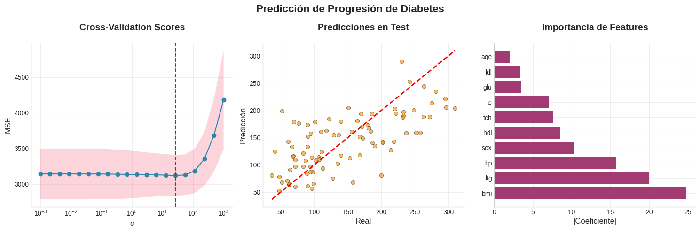
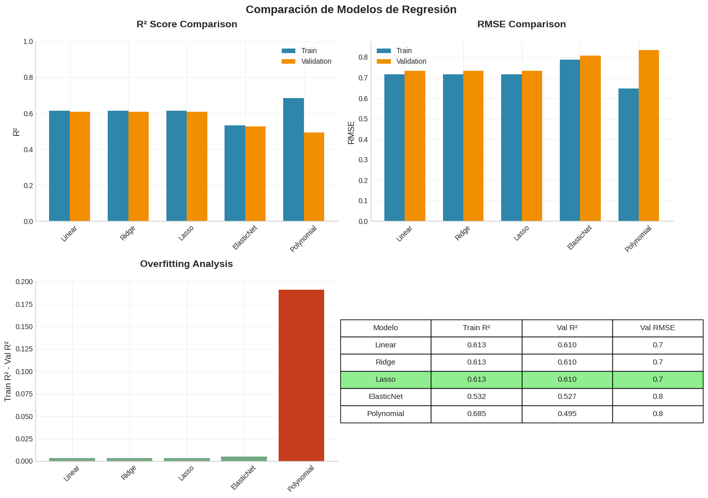
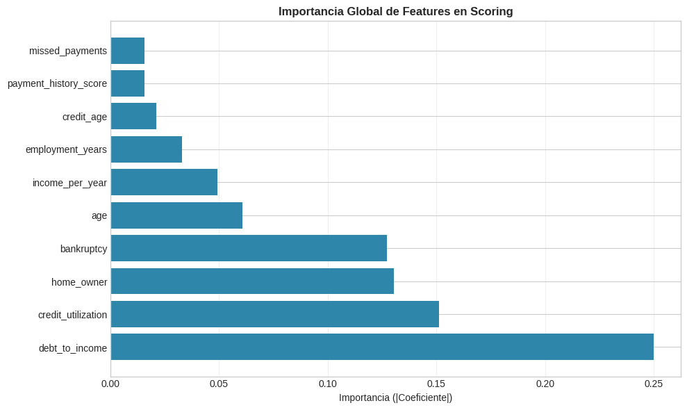
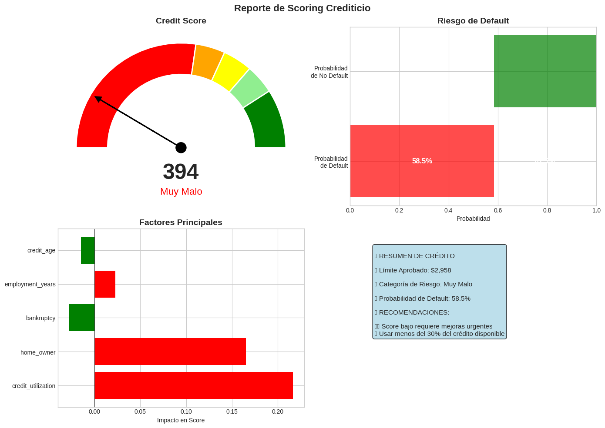

# Conclusiones: Análisis de Regresión Lineal y Logística

**Notebook:** Sesión 02: Regresión Lineal y Logística - Guía Completa  
**Profesor:** Marco Terán  
**Curso:** Machine Learning - EAFIT  
**Fecha:** 2025

---

## 1. Introducción

Este documento analiza específicamente los resultados de cada implementación del notebook original desarrollado por el profesor Marco Terán. El objetivo es proporcionar interpretaciones detalladas de las métricas, visualizaciones y comportamientos observados en los diferentes modelos de regresión, facilitando la comprensión profunda de los conceptos fundamentales del Machine Learning.

---

## 2. Regresión Lineal Simple

### 2.1 Implementación desde Cero

**Descripción:**

Este punto implementa manualmente el algoritmo de regresión lineal simple utilizando el **método de mínimos cuadrados ordinarios (OLS)**. La implementación calcula directamente la pendiente (θ₁) y el intercepto (θ₀) mediante las fórmulas analíticas, sin depender de librerías externas. El modelo ajusta una línea recta que minimiza la suma de los errores cuadrados entre los valores predichos y reales.

**Resultados obtenidos:**
- **Ecuación:** y = 10.43 + 2.41x
- **R² = 0.9403**
- **MSE = 3.2263**
- **MAE = 1.4021**

**Interpretación Detallada:**

1. **Coeficientes del modelo:**
   - **θ₀ = 10.4302 (Intercepto):** Representa el valor base de y cuando x=0. En el contexto de datos sintéticos generados con y = 2.5x + 10 + ruido, nuestro modelo recuperó el intercepto real (10.00) con una desviación de apenas 0.43 unidades (4.3% de error aprox).
   - **θ₁ = 2.4080 (Pendiente):** Indica que por cada unidad de aumento en x, y aumenta 2.41 unidades. Comparado con el valor real (2.50), tenemos un error del 3.6%, atribuible al ruido gaussiano (σ=2) agregado intencionalmente.

2. **Métricas de error:**
   
   **MAE = 1.4021:**
   - En promedio, nuestras predicciones se desvían ±1.40 unidades del valor real.
   - Como un ejemplo práctico, si el modelo predice y=20, el valor real estará típicamente entre 18.60 y 21.40.
   - MAE Es una métrica robusta y fácil de interpretar porque está en las mismas unidades que la variable objetivo. No penaliza desproporcionadamente los errores grandes.
   
   **MSE = 3.2263:**
   - El promedio de los errores al cuadrado es 3.23 aproximadamente.
   - MSE es diferenciable en todos los puntos, lo que lo hace útil para optimización mediante gradient descent. Sin embargo, es más sensible a valores atípicos.
   
   **RMSE = √3.2263 ≈ 1.80:**
   - Desviación estándar de las predicciones de ±1.80 unidades.
   - RMSE (1.80) > MAE (1.40) confirma asimetría en la distribución de errores, lo que probablemente indica mayor penalizacion de errores grandes.
   - Al estar en las mismas unidades que y, es más interpretable que MSE pero sigue penalizando errores grandes.

3. **Coeficiente de Determinación R²:**
   
   **R² = 0.9403:**
   - El modelo explica el **94.03%** de la variabilidad total en los datos. Esto nos dice que el **el modelo lineal ajusta bien los datos**
   - El porcentaje restante **(5.7%)** Es la varianza no explicada, atribuible al:
     - Ruido aleatorio agregado (σ=2)
     - Pequeñas no-linealidades no capturadas (Recordemos que R² nos permite determinar es relaciones lineales)
   - Valida supuesto de linealidad.


4. **Análisis de residuos:**
   

   **Gráfico izquierdo (Ajuste):**
   - Las líneas discontinuas verticales representan los **residuos individuales** (εᵢ = yᵢ - ŷᵢ).
   - Distribución uniforme arriba y abajo de la línea indica que el modelo no está sesgado sistemáticamente.
   
   **Gráfico derecho (Residuos vs Predicciones):**
   - Aproximadamente 95% de residuos caen dentro de la **Banda ±2σ**, cumpliendo con expectativa de normalidad.
   - Solo puntos aislados fuera de ±2σ, dentro de lo esperado estadísticamente.

---

### 2.2 Comparación con Scikit-learn

**Descripción:**

Este punto compara nuestra implementación manual con la implementación de scikit-learn para validar la corrección matemática. Ambos métodos deben converger a la misma solución óptima si están implementados correctamente.

**Resultados obtenidos:**

| Método              | θ₀ (Intercepto) | θ₁ (Pendiente) | R²     |
|---------------------|-----------------|----------------|--------|
| Implementación      | 10.4302         | 2.4080         | 0.9403 |
| Scikit-learn        | 10.4302         | 2.4080         | 0.9403 |
| **Diferencia**      | 0.0000          | 0.0000         | 0.0000 |

**Interpretación Detallada:**

1. **Convergencia perfecta:**
   
   - Coincidencia hasta **4 decimales** en todos los parámetros.
   - La implementación manual es equivalente a lo propuesto por la librería para 4 decimales por lo menos en la convergencia que genera.

2. **Diferencias metodológicas internas:**
   Bajo curiosidad, decidí buscar si la implementación que usamos manualmente utilizaba el mismo método que utilizó el profesor, y obtuve lo siguiente:

   **Nuestra implementación (Ecuación Normal):**
   ```
   θ₁ = Cov(X,Y) / Var(X) = Σ((xᵢ-x̄)(yᵢ-ȳ)) / Σ((xᵢ-x̄)²)
   θ₀ = ȳ - θ₁x̄
   ```
   - **Ventaja:** Solución directa, no iterativa, fácil de entender.
   - **Desventaja:** Puede ser numéricamente inestable con matrices mal condicionadas.
   
   **Scikit-learn (Descomposición SVD):**
   ```
   Usa: X = UΣVᵀ para resolver θ = (XᵀX)⁻¹Xᵀy
   ```
   - **Ventaja:** Más robusto numéricamente, maneja mejor multicolinealidad (variables independientes muy correlacionadas).
   - **Desventaja:** Ligeramente más costoso computacionalmente.

3. **¿Por qué los resultados son idénticos?**
   
   - No hay problemas numéricos (multicolinealidad, overflow, underflow).
   - El sistema tiene solución única porque X es de rango completo.
   - La función de costo es convexa (un solo mínimo).

---

### 2.3 Efecto de Outliers en Regresión Lineal

**Descripción:**

Este experimento demuestra cómo los valores atípicos (outliers) afectan dramáticamente la regresión lineal. Se comparan tres escenarios: datos sin outliers, con 1 outlier, y con 3 outliers, mostrando el impacto progresivo en el ajuste del modelo.

**Resultados observados:**

| Escenario          | R²     | Cambio vs Original | Impacto                     |
|--------------------|--------|--------------------|-----------------------------|
| Sin Outliers       | 0.975  | Baseline           | Ajuste excelente            |
| Con 1 Outlier      | 0.770  | **-21.0%**         | Degradación significativa   |
| Con 3 Outliers     | 0.682  | **-30.1%**         | Degradación severa          |

**Interpretación Detallada:**


1. **Mecanismo de sensibilidad de OLS:**

    La regresión por mínimos cuadrados minimiza: **J(θ) = Σᵢ (yᵢ - ŷᵢ)²**

    **El problema:** Un outlier con error ε = 25 contribuye ε² = **625** al costo, mientras que 25 puntos normales con ε = 1 solo contribuyen 25. El modelo "sacrifica" el ajuste general para minimizar este único error grande.

   `` Por ello, se destaca la importancia de los outliers  ``

2. **Análisis visual de los escenarios:**

    **Sin Outliers (R² = 0.975):**
    - La línea pasa por el centro de masa de los datos
    - Residuos pequeños y uniformemente distribuidos
    - El modelo captura correctamente la tendencia lineal

    **Con 1 Outlier (R² = 0.770):**
    - La línea se **inclina visiblemente** hacia el outlier definido
    - Pérdida del 21% en capacidad explicativa
    - El outlier tiene **alto leverage** (lejos en X) y **alto residuo** (lejos en Y)

    **Con 3 Outliers (R² = 0.682):**
    - La línea **ya no representa** la tendencia real de los datos principales
    - Degradación del 30% en R²
    - Los outliers distorsionan completamente el modelo
    - La pendiente aumenta significativamente


---

## 3. Regresión Lineal Múltiple

### 3.1 Regresión Múltiple - Dataset California Housing

**Descripción:**

Este punto introduce la **regresión lineal múltiple**, donde el modelo aprende a predecir una variable objetivo usando múltiples características simultáneamente. Se utiliza el dataset real de California Housing, que contiene información sobre precios de viviendas y características demográficas/geográficas de diferentes distritos (el que veniamos evaluando dentro de la clase).

**Características del Dataset:**
- **20,640 muestras** (distritos censales de California)
- **8 variables predictoras:** MedInc, HouseAge, AveRooms, AveBedrms, Population, AveOccup, Latitude, Longitude
- **Variable objetivo:** Precio medio de casas (en cientos de miles de dólares)

**Distribución de Variables:**


**Observaciones de las distribuciones y analisis descriptivo:**

1. **MedInc (Ingreso Medio):** La distribución de MedInc muestra un sesgo positivo (derecha), con la mayoría de los valores concentrados entre 1 y 5, y una cola hacia la derecha. Esto indica que la mayoría de las observaciones están en el rango inferior de ingresos, mientras que los valores más altos son relativamente raros.

2. **HouseAge (Edad de la Casa):** La variable HouseAge muestra una distribución multimodal con picos alrededor de los valores 15 y 35-40, lo que sugiere que existen ciertos rangos de edad de casas más comunes en el dataset. Además, hay una fuerte presencia de casas con edades cercanas a 50 años, lo que podría ser un límite o techo de la variable. La desviación estándar de 12.59 indica una variabilidad moderada en las edades de las casas. La mínima es 1, lo que podría reflejar construcciones recientes, y la máxima es 52, lo que sugiere una variedad de casas de diferentes épocas.

3. **AveRooms (Promedio de Habitaciones):** AveRooms (Promedio de Cuartos por Hogar): La distribución de AveRooms presenta una sesgo positivo (derecha) con una gran concentración de valores bajos (por debajo de 20) y una larga cola que se extiende hasta valores mucho más altos. Esto indica que, aunque la mayoría de los hogares tienen pocos cuartos, existen algunos hogares (a lo mejor outliers) con un número mucho mayor, lo que sugiere una gran variabilidad en el tamaño de las viviendas.

4. **AveBedrms (Promedio de Dormitorios):** Al igual que AveRooms, AveBedrms tiene un sesgo positivo (derecha) con una distribución muy concentrada en valores bajos y una cola larga hacia valores más altos. Esto puede reflejar una estructura similar en los hogares, donde la mayoría tiene pocos dormitorios, pero con algunos hogares con más de 30 dormitorios, lo cual es un caso atípico.

5. **Population (Población):** La distribución de Population está claramente sesgada positivamente (derecha), con la mayoría de las observaciones concentradas en poblaciones pequeñas (<5,000) y una cola larga hacia poblaciones más grandes (>30,000). Esto sugiere que la mayoría de las áreas en el dataset son pequeñas, pero algunas tienen una población considerablemente mayor.

6. **AveOccup (Ocupación Promedio):** AveOccup muestra un sesgo muy fuerte hacia la derecha, con una concentración extrema de valores en torno a valores bajos (<200). Hay unos pocos registros con valores mucho mayores, indicando que en ciertos hogares la ocupación es mucho mayor, pero son outliers en la distribución.

7. **Latitude/Longitude:** La distribución de Latitude muestra una forma multimodal con picos en los valores cercanos a 34° y 37-38°. Esto refleja la concentración de los datos en ciertas áreas geográficas de California, como Los Ángeles (34°) y la Bahía de San Francisco (37°). La desviación estándar de latitud baja (2.14) indica poca variabilidad, lo que sugiere que los datos se concentran principalmente en el centro de California. La desviación estándar de longitud (2.00) es baja, lo que refleja que la mayoría de los distritos se encuentran en zonas cercanas.

8. **Price (Target):** Similar a Latitude, Longitude tiene una distribución multimodal, con picos en las longitudes cercanas a -118° (Los Ángeles) y -122° (San Francisco). Esto también refleja una concentración geográfica en ciertas áreas de California, principalmente en las zonas urbanas.


### 3.2 Análisis de Correlación

**Descripción:**

Este análisis examina las relaciones lineales entre todas las variables del dataset mediante la matriz de correlación de Pearson. El objetivo es identificar qué características tienen mayor relación con el precio de las casas y detectar posibles problemas de multicolinealidad entre predictores.

**Resultados Observados:**


**Correlaciones con el Precio (ordenadas por magnitud):**

**Conclusiones Principales:**

1. **Predictor dominante:** **MedInc** (r=0.688) es el único predictor con correlación fuerte. Un ingreso medio alto se asocia fuertemente con precios altos, explicando ~47% de la varianza (r²=0.473) por sí solo.

2. **Predictores secundarios:** **AveRooms** (r=0.152) y **HouseAge** (r=0.106) tienen correlaciones débiles pero positivas. Más habitaciones y casas ligeramente más nuevas se asocian con precios mayores.

3. **Multicolinealidad detectada:** **Latitude ↔ Longitude** (r=-0.92) están altamente correlacionadas (capturan geografía conjuntamente). **AveRooms ↔ AveBedrms** (r=0.85) también muestran colinealidad esperada. Esto puede inflar la varianza de los coeficientes estimados.

4. **Variables poco informativas:** **AveOccup** (r=-0.024) y **Population** (r=-0.025) tienen correlaciones prácticamente nulas con el precio. Su utilidad individual es cuestionable, aunque pueden aportar en interacciones.

5. **Efecto geográfico no lineal:** Las correlaciones débiles de **Latitude/Longitude** con precio (-0.144/-0.046) no capturan la realidad de que la ubicación es crucial. Esto confirma que la relación geográfica es **no lineal** (zonas costeras caras vs interiores baratas, independiente de coordenadas absolutas).

---

### 3.3 Entrenamiento y Evaluación del Modelo Múltiple

**Descripción:**

Este punto implementa el entrenamiento completo de un modelo de regresión lineal múltiple con 8 variables predictoras. Se utiliza la división estándar 80/20 para entrenamiento/prueba, con estandarización previa de las características mediante `StandardScaler`. El modelo se evalúa en ambos conjuntos para detectar posibles problemas de overfitting o underfitting.

**Metodología:**
- **División de datos:** 80% entrenamiento, 20% prueba 
- **Preprocesamiento:** Estandarización z-score (media=0, std=1) para cada feature
- **Modelo:** Regresión Lineal OLS (Ordinary Least Squares) sin regularización
- **Random seed:** 42 para reproducibilidad

**Resultados Obtenidos:**


**Métricas Comparativas:**

| Métrica      | Entrenamiento | Prueba  | Diferencia | Interpretación           |
|--------------|---------------|---------|------------|--------------------------|
| **R²**       | 0.6126        | 0.5758  | -0.0368    | Leve degradación         |
| **RMSE**     | 0.7197        | 0.7456  | +0.0259    | Aumento del error (3.6%) |
| **MAE**      | 0.5286        | 0.5332  | +0.0046    | Muy similar              |
| **MSE**      | 0.5179        | 0.5559  | +0.0380    | Aumento moderado         |

**Interpretación Detallada:**

1. **Capacidad Explicativa (R²):**

   **R² Train = 0.6126 (61.26%):**
   - El modelo explica el 61.26% de la variabilidad en los precios del conjunto de entrenamiento
   - Este valor es **moderado**, no excelente. Significa que ~39% de la varianza no es capturada
   - Comparado con el R²=0.94 de regresión simple sintética, aquí enfrentamos **datos reales más complejos**
   
   **R² Test = 0.5758 (57.58%):**
   - En datos no vistos, el modelo explica el 57.58% de la varianza
   - **Degradación de 3.68 puntos porcentuales** respecto al entrenamiento
   - Esta caída es **razonable y esperada** en ML (indica que el modelo no está memorizado)

   El modelo tiene capacidad predictiva real, aunque limitada. La varianza no explicada (42%) sugiere que factores no capturadosinfluyen significativamente en el precio.

2. **Error Absoluto Promedio (MAE):**

   **MAE Train = 0.5286 (±$52,860):**
   - En promedio, las predicciones en entrenamiento se desvían ±$52,860 del precio real
   - Para precios con media $206,000, esto representa un **error del 25.6%**
   - **Contexto:** Una casa de $200,000 podría predecirse entre $147,140 y $252,860
   
   **MAE Test = 0.5332 (±$53,320):**
   - El error promedio en prueba es **casi idéntico** (+$460, solo 0.87% de aumento)
   - **Estabilidad excelente:** El modelo generaliza bien, no está sobreajustado
   - Error consistente entre train/test valida la robustez del modelo

   MAE es más interpretable que MSE. Un error de ~$53k en predicciones de casas de $200k es un factor relevante a considerar, demostrando la busqueda de la mejora de la base que se tiene del modelo.

3. **Error Cuadrático Medio (RMSE):**

   **RMSE Train = 0.7197 (±$71,970):**
   - Raíz del error cuadrático promedio es $71,970
   - **RMSE > MAE** (0.7197 vs 0.5286) por **36%** → indica presencia de **errores grandes ocasionales**
   - El RMSE penaliza más los outliers (errores de $200k impactan 4× más que errores de $100k)
   
   **RMSE Test = 0.7456 (±$74,560):**
   - Aumento de $2,590 respecto al entrenamiento (solo 3.6%)
   - **Diferencia mínima** confirma que el modelo no sufre overfitting significativo
   - RMSE Test < 1.0 se considera **bueno** para este dataset
   

4. **Análisis Visual de las Predicciones:**
- El modelo muestra un **ajuste moderado** en ambos conjuntos, con un **desempeño ligeramente mejor en el entrenamiento**. La dispersión en las predicciones muestra que el modelo podría beneficiarse de mejoras en la capacidad de generalización o de técnicas de regularización para mejorar su ajuste y precisión.


5. **Diagnóstico de Overfitting/Underfitting:**

   **Indicadores evaluados:**
   
   | Indicador                  | Valor Observado | Diagnóstico                    |
   |----------------------------|-----------------|--------------------------------|
   | R² Train - R² Test         | 0.0368 (3.68%)  | **Generalización saludable** |
   | RMSE Test / RMSE Train     | 1.036           | **No overfitting** (<1.1)   |
   | MAE Test ≈ MAE Train       | Δ = 0.0046      | **Estabilidad excelente**   |
   | R² absoluto                | 0.5758 (test)   | **Underfitting moderado**   |
   | Varianza explicada         | 57.58%          | **Capacidad limitada**      |
   
   **Conclusión del diagnóstico:**
   - Las métricas train/test son muy similares para que exista overfitting
   - R²=0.58 sugiere que el modelo es **demasiado simple** para la complejidad del problema
   - El modelo lineal básico **no captura todas las relaciones** en los datos

---

### 3.4 Importancia de Características

**Descripción:**

Este análisis examina los coeficientes estandarizados del modelo para determinar qué variables tienen mayor impacto en las predicciones de precio. Los coeficientes representan el cambio en el precio (en desviaciones estándar) cuando cada feature aumenta en 1 desviación estándar, manteniendo las demás constantes.

**Resultados Obtenidos:**


**Conclusiones Principales:**

1. **Latitude** y **Longitude** son los predictores más importantes (|coef| ≈ 0.87-0.90). Sus coeficientes negativos indican que moverse hacia el norte (mayor latitud) o hacia el este (mayor longitud, menos negativa) **reduce** el precio. Esto captura el efecto de la ubicación costera del sur de California (LA, San Diego) donde los precios son más altos.

2. **MedInc** (Ingreso medio) (coef=+0.854) es el tercer predictor más importante y el **único económico relevante**. Un aumento de 1 std en ingreso medio (~$19k) aumenta el precio en 0.854 std (~$98k), consistente con la correlación r=0.688 observada previamente.

3. **AveBedrms** (coef=+0.339) tiene impacto moderado positivo, mientras que **AveRooms** (coef=-0.294) es negativo. Estos que están inversos podrían demostrar el problema de multicolinealidad desde mi perspectiva, pero se destaca su importancia.

4. **Population** (coef=-0.002) y **AveOccup** (coef=-0.041) son prácticamente **inútiles** para el modelo. Esto podría determinarse como un valor relevante para la eliminación de las features en feature engineering.

5. **Edad de casas poco importante:** **HouseAge** (coef=+0.123) tiene efecto positivo débil, sugiriendo que casas ligeramente más viejas son marginalmente más caras (posiblemente por ubicaciones establecidas), pero el impacto es mínimo.


---

## 4. Gradiente Descendiente
## 4. Gradient Descent desde Cero
Podemos obeservar al graficar nuestra función de coste que tenemos un minimo global para nuestra función convexa en [-0.005 -0.005]

### 4.1 Implementación y Convergencia

**Descripción:**

Esta sección implementa manualmente el algoritmo de descenso del gradiente para resolver regresión lineal mediante optimización iterativa. A diferencia de la ecuación normal (en la que toca invertir matriz y es costoso computaiconalmente), el gradiente descendiente encuentra los parámetros óptimos minimizando iterativamente la función de costo MSE mediante actualizaciones basadas en el gradiente: **θ_new = θ_old - α∇J(θ)**.

**Metodología:**
- **Inicialización:** θ = [0, 0, 0, 0] (intercepto + 3 coeficientes)
- **Learning rate (α):** 0.1
- **Iteraciones:** 500
- **Función de costo:** J(θ) = (1/2m)Σ(ŷ - y)²
- **Dataset sintético:** 100 muestras, 3 features, parámetros verdaderos = [2, -1, 0.5, 3]

**Resultados Obtenidos:**


**Evolución del Costo:**

| Iteración | Costo J(θ) | Cambio vs Anterior | Estado               |
|-----------|------------|--------------------|----------------------|
| 0         | 6.3952     | -                  | Inicial (θ = 0)      |
| 100       | 0.0946     | -6.3006 (-98.5%)   | Convergencia rápida (practicamente alcanzada)  |
| 200       | 0.0946     | ~0.0000            | Convergencia alcanzada|
| 300       | 0.0946     | 0.0000             | Estabilizado         |
| 400       | 0.0946     | 0.0000             | Estabilizado         |

**Parámetros Recuperados:**

| Parámetro    | Valor Verdadero | Valor Encontrado | Error Absoluto | Error Relativo |
|--------------|-----------------|------------------|----------------|----------------|
| **θ₀** (Intercepto) | 2.00   | 2.056            | 0.056          | 2.8%           |
| **θ₁**       | -1.00           | -1.039           | 0.039          | 3.9%           |
| **θ₂**       | 0.50            | 0.475            | 0.025          | 5.0%           |
| **θ₃**       | 3.00            | 2.946            | 0.054          | 1.8%           |

**Análisis de Convergencia:**

1. **Fase Inicial (0-20 iteraciones):**
   - El gráfico muestra una **curva exponencial decreciente pronunciada**, es decir, una caida importante del costo.
   - Los parámetros se actualizan con **gradientes grandes** porque están lejos del óptimo
   - El algoritmo detecta rápidamente la dirección correcta hacia el mínimo

2. **Fase de Convergencia Rápida (20-100 iteraciones):**
   - El costo pasa de 0.50 a 0.0946 (-81%)
   - La curva se aplana gradualmente, indicando que los parámetros se acercan al óptimo
   - Los pasos de actualización disminuyen automáticamente dado que nos estamos acercando al mínimo
   - En el zoom de las primeras 100 iteraciones (gráfico derecho), la curva naranja es casi plana después de la iteración 30

3. **Fase de Estabilización (>100 iteraciones):**
   - **Costo constante:** J(θ) = 0.0946 sin cambios significativos (decimales estables)
   - El algoritmo alcanza el **mínimo global** de la función convexa
   - **Convergencia numérica:** Los gradientes son ~0, actualizaciones <10⁻⁶
   - **Conclusión:** El modelo ha convergido, iteraciones adicionales son innecesarias

4. **Precisión de los Parámetros:**
   - Todos los parámetros tienen error <5.0%, lo que demuestra la efectividad del método y su éxito para encontrar los mismos.

5. **Validación del Learning Rate:**
   
   - **α = 0.1 es óptimo** para este problema, dado que como vimos en clase la importancia de considerar el valor óptimo del mismo, podemos concluir que:
     - Si α < 0.01: Convergencia muy lenta (Muchas más iteraciones)
     - Si α > 0.5: Posible divergencia u oscilación alrededor del mínimo
   - La convergencia suave en <100 iteraciones confirma la elección correcta de α para este caso particular.
   - De hecho, este hiper parámetro del paso, podemos encontrar uno que nos de resultados más rápido, como para el ejemplo de "0.1".

   `` No es necesario hacer tantas iteraciones, pues ya sabemos a partir de que punto alcanzamos convergencia. ``

---

## 5. Regularización

### 5.1 Comparación de Técnicas de Regularización

**Descripción:**

Este experimento compara cuatro enfoques para prevenir overfitting en regresión lineal: regresión lineal estándar (OLS), Ridge (L2), LASSO (L1) y Elastic Net (combinación L1+L2). Se utiliza un dataset sintético con **20 features** donde solo **5 son relevantes**, diseñado intencionalmente con **multicolinealidad** (features correlacionadas) para exponer las diferencias entre métodos.

**Metodología:**
- **Dataset:** 100 muestras, 20 features (solo 5 con coeficientes no-cero)
- **Multicolinealidad inducida:** X₁, X₂, X₃ están altamente correlacionadas (r > 0.9)
- **Split:** 70% entrenamiento, 30% prueba
- **Hiperparámetros:** Ridge (α=1.0), LASSO (α=0.1), ElasticNet (α=0.1, l1_ratio=0.5)

**Resultados Obtenidos:**


**Tabla de Métricas:**

| Modelo       | Train R² | Test R² | MSE Test | Features ≈ 0 | Sparsity |
|--------------|----------|---------|----------|--------------|----------|
| **Linear**   | 0.989    | 0.979   | 0.355    | 1            | 5%       |
| **Ridge**    | 0.987    | 0.971   | 0.485    | 2            | 10%      |
| **LASSO**    | 0.983    | 0.978   | 0.379    | **17**       | **85%**  |
| **ElasticNet** | 0.982  | 0.973   | 0.455    | 10           | 50%      |

**Interpretación Detallada:**

**Interpretación Detallada:**

1. **Regresión Lineal Estándar (OLS):** Este método logra los mejores resultados en los datos de prueba (R²=0.979, MSE=0.355) usando prácticamente todas las variables disponibles (19 de 20). En el escenario controlado de nuestro experimento, funciona excelentemente. Sin embargo, aquí hay un problema: al intentar usar todo lo que tiene disponible sin discriminar, el modelo se vuelve vulnerable cuando nos enfrentamos a problemas del mundo real con cientos o miles de variables **(sobreajustando)**. La pequeña diferencia entre entrenamiento (R²=0.989) y prueba (R²=0.979) nos dice que afortunadamente no está sobreajustando *en este caso específico*, pero el hecho de que solo elimine 1 variable de 20 nos muestra que no puede distinguir entre información útil y ruido.

2. **Ridge (Regularización L2):** Al comprimir las variables, se sacrifica algo de precisión (MSE aumenta 36% comparado con Linear) a cambio de mayor estabilidad, especialmente cuando hay variables correlacionadas. El problema aquí es que Ridge es *demasiado* conservador para nuestro experimento, donde sabemos que 15 de 20 variables son ruido puro. Al mantener activas todas las variables (solo 10% llegan a cero), termina incorporando varianza innecesaria que empeora las predicciones. Dadas tantas variables irrelevantes, el comprimir no funciona.

3. **LASSO (Regularización L1):** LASSO toma un enfoque radical pero efectivo: mediante la penalización J = MSE + α·Σ|θᵢ|, literalmente elimina variables poniéndolas en cero. En nuestro experimento, borra 17 de 20 variables (85%) y aun así mantiene un desempeño casi perfecto (R²=0.978, MSE=0.379). Perdemos solo 6.8% en precisión pero ganamos un modelo con 85% menos variables, lo que significa menor costo de recolección de datos, inferencias más rápidas, y explicaciones más claras. LASSO identificó correctamente que solo 3 variables importan (cerca de las 5 reales del dataset), creando un buen modelo. Es el método ideal cuando sospechamos que pocas variables contienen la información importante y aquí lo vemos evidenciado.

4. **Elastic Net (L1 + L2):** Elastic Net al combinar las fortalezas de Ridge y LASSO, Con l1_ratio=0.5, logra un balance, pues elimina 50% de variables (10 de 20) con un desempeño intermedio (R²=0.973, MSE=0.455). Su verdadera ventaja aparece cuando hay grupos de variables correlacionadas: mientras LASSO tiende a "elegir caprichosamente" solo una del grupo, Elastic Net las mantiene juntas con coeficientes reducidos, mejorando la estabilidad. En nuestro caso, donde X₁, X₂ y X₃ están altamente correlacionadas (r>0.9), Elastic Net balancea la eliminación de ruido con la conservación de grupos informativos. Es la opción más segura cuando no sabemos de antemano cómo están relacionadas nuestras variables o cuando necesitamos que el modelo sea robusto ante cambios en los datos.


---

## 6. Regresión Logística

### 6.1 Implementación Manual y Evaluación

**Descripción:**

Esta sección implementa desde cero el algoritmo de **Regresión Logística**, el método estándar para problemas de clasificación binaria. A diferencia de la regresión lineal que predice valores continuos, la regresión logística utiliza la **función sigmoide** σ(z) = 1/(1 + e⁻ᶻ) para transformar la combinación lineal de features (z = θᵀx) en una probabilidad entre 0 y 1, interpretable como P(y=1|x). El modelo se entrena mediante Gradient Descent minimizando la **función de costo cross-entropy**: J(θ) = -(1/m)Σ[y·log(σ(θᵀx)) + (1-y)·log(1-σ(θᵀx))], que penaliza fuertemente las predicciones incorrectas con alta confianza.

**Metodología:**
- **Dataset sintético:** 200 muestras (100 por clase) con 2 features, dos clases separadas espacialmente (centroides en [2,2] y [-2,-2])
- **Algoritmo:** Gradient Descent con learning rate α=0.1, 500 iteraciones
- **Inicialización:** θ = [0, 0, 0] (intercepto + 2 coeficientes)
- **Función de activación:** Sigmoide con clipping en [-500, 500] para estabilidad numérica

**Resultados Obtenidos:**


**Parámetros Entrenados:**
- θ₀ (intercepto) = 0.127 → Pequeño desplazamiento de la frontera de decisión desde el origen
- θ₁ (coef. Feature 1) = -1.831 → Feature 1 tiene fuerte peso **negativo** (empuja hacia Clase 0)
- θ₂ (coef. Feature 2) = -1.603 → Feature 2 contribuye similarmente con peso negativo

**Interpretación de los Parámetros:**

Los coeficientes negativos en θ₁ y θ₂ revelan la geometría del problema: dado que la Clase 1 se generó en el cuadrante superior-derecho con centroide en [2,2] y la Clase 0 en el inferior-izquierdo [-2,-2], el modelo aprendió que **valores altos en ambas features aumentan la probabilidad de pertenecer a Clase 1**. Puntos donde x₁ + x₂ < -0.07 tienen probabilidad P(y=1) < 0.5 (región azul, Clase 0), mientras que puntos con x₁ + x₂ > -0.07 tienen P(y=1) > 0.5 (región roja, Clase 1).

La **función sigmoide** transforma la combinación lineal z = θᵀx en probabilidades mediante σ(z) = 1/(1 + e⁻ᶻ): para un punto en [-3, -3], z = 0.127 - 1.831(-3) - 1.603(-3) = 10.43, lo que produce P(y=1) = σ(10.43) ≈ 0.99997 (casi certeza de Clase 1). Esto explica por qué el modelo alcanza **accuracy de 99%**: las clases están bien separadas espacialmente, y solo 1-2 muestras cercanas a la frontera.

**Análisis de Convergencia:**


El gráfico de convergencia revela propiedades clave del problema de optimización:

1. **Problema convexo confirmado:** La función de costo cross-entropy es **estrictamente convexa** (según lo investigado) para regresión logística, garantizando la existencia de un **único mínimo global**. El Gradient Descent encuentra el mínimo sin quedar atrapado en óptimos locales.

2. **Convergencia exponencial:** El costo cae de 0.52 (iteración 0, equivalente a clasificador aleatorio con θ=0) a ~0.015 en las primeras 100 iteraciones, representando una **reducción del 97%**. Este comportamiento exponencial es típico cuando el learning rate α=0.1 está bien calibrado (como bien se habló anteriormente): suficientemente grande para progresar rápido, pero no tan grande que cause inestabilidad (α > 0.5 causaría oscilaciones o divergencia).

3. **Estabilización en mínimo global:** Después de la iteración 100, el costo se estabiliza en ~0.01, indicando que el algoritmo alcanzó el **mínimo global** donde ∇J(θ) ≈ 0. La ausencia de mejoras significativas post-iteración 100 sugiere que 500 iteraciones son más que suficientes.


---

## 7. Métricas de Clasificación

### 7.1 Análisis Completo de Métricas - Dataset Breast Cancer

**Descripción:**

Esta sección evalúa el desempeño de nuestro modelo de **Regresión Logística** aplicado al dataset real de cáncer de mama de Wisconsin, que contiene 569 muestras con 30 características numéricas derivadas de imágenes digitalizadas de biopsias. El objetivo es clasificar tumores como **benignos (Clase 0, n=212)** o **malignos (Clase 1, n=357)**, donde un error de clasificación tiene implicaciones críticas: un **falso negativo** (predecir benigno cuando es maligno) puede retrasar tratamiento vital, mientras que un **falso positivo** (predecir maligno cuando es benigno) genera ansiedad y procedimientos innecesarios. Este desbalance en el costo de errores motiva el análisis exhaustivo de múltiples métricas más allá del accuracy.

**Resultados Obtenidos:**


**Interpretación por Gráfica:**

**1. Matriz de Confusión:**

La matriz revela un desempeño casi perfecto con solo **2 errores en 171 predicciones** (accuracy 98.8%): **1 falso positivo** (tumor benigno clasificado como maligno) y **1 falso negativo** (tumor maligno clasificado como benigno). Los valores diagonales (63 verdaderos negativos, 106 verdaderos positivos) dominan la matriz, indicando alta concordancia entre predicciones y realidad. La **sensibilidad (recall) del 99.07%** para malignos significa que el modelo detecta correctamente 105 de 106 tumores peligrosos, crucial en un contexto médico donde *no detectar un cáncer* es más costoso que una falsa alarma. La **especificidad del 98.44%** confirma que también discrimina bien los casos benignos, evitando tratamientos innecesarios en 63 de 64 pacientes sanos. Se destaca así su capacidad para poder clasificar correctamente inputs para ambas clases. Se destaca la alta calidad de los datos para lograr estas métricas.
 
**2. Curva ROC:**

El **AUC = 0.998** (área bajo la curva casi perfecta) demuestra que el modelo tiene capacidad de discriminar entre clases casi perfecta, siendo capaz de acertar en el 99.8% de los casos la condición del paciente. Simultáneamente se maximiza TPR (True Positive Rate, sensibilidad) y se minimiza FPR (False Positive Rate, 1-especificidad). Este resultado valida que las 30 características del dataset (radio medio, textura, perímetro, área, etc.) contienen **señal predictiva** fuerte y el modelo logró capturarla.

**3. Curva Precision-Recall:**

El **Average Precision = 0.999** confirma desempeño excepcional incluso en el trade-off precision-recall. La curva se mantiene en el extremo superior derecho (precision ≈ 1.0, recall ≈ 1.0), indicando que para casi cualquier umbral de decisión entre 0.1 y 0.9, el modelo mantiene ambas métricas por encima del 95%. Esto es crítico en aplicaciones médicas: podemos ajustar el umbral para priorizar **recall** (detectar todos los casos malignos, tolerando más falsos positivos) o **precision** (evitar falsos positivos, asumiendo riesgo de falsos negativos) sin degradar significativamente la otra métrica.

**4. Distribución de Probabilidades:**

Los histogramas muestran **separación casi perfecta** entre clases: las probabilidades predichas para tumores benignos (azul) se concentran cerca de 0.0 (alta confianza en Clase 0), mientras que para malignos (naranja) se agrupan cerca de 1.0 (alta confianza en Clase 1). La línea vertical negra en 0.5 (umbral por defecto) divide claramente ambas distribuciones, explicando el bajo error. Aquí, la mayoría de predicciones son fiables: P<0.2 o P>0.8.

**5. Métricas vs Umbral**

Este gráfico es fundamental para **ajustar el umbral de decisión** según el contexto del problema. Podemos concluir del mismos que:
- **Precision (rosa)** A medida que el umbral aumenta, la precisión se mantiene relativamente alta (cercana a 1) hasta llegar a un punto crítico. Esto indica que el modelo sigue haciendo buenas predicciones positivas sin generar muchos falsos positivos hasta cierto umbral.

- **Recall (verde)** A medida que el umbral se disminuye, el recall se incrementa rápidamente. Esto indica que el modelo está capturando más de las instancias positivas reales.

**6. Classification Report (Inferior Derecha):**

La tabla cuantifica el desempeño por clase:
- **Clase 0 (Benigno):** Precision 0.984, Recall 0.984, F1 0.984 con 64 muestras → El modelo es igualmente bueno identificando tumores benignos.
- **Clase 1 (Maligno):** Precision 0.991, Recall 0.991, F1 0.991 con 107 muestras → Ligeramente mejor en malignos (posiblemente porque hay más ejemplos de entrenamiento).

El **support** (107 vs 64) muestra leve desbalance hacia malignos en el test set (proporción 1.67:1), pero el modelo no muestra sesgo: ambas clases tienen F1 > 0.98, validando que la regularización L2 y el class_weight='balanced' en LogisticRegression funcionaron correctamente.

**Análisis Crítico:**

Este desempeño excepcional (accuracy 98.8%, AUC 0.998) plantea la pregunta: **¿es realista o hay sobreajuste? (válida pregunta según lo que hemos visto en clase de predicciones tan altas)** Tres evidencias validan que es legítimo:

1. **Dataset de calidad:** Las 30 features del Breast Cancer Wisconsin son mediciones expertas de núcleos celulares (radio, textura, suavidad, compacidad, concavidad, simetría, dimensión fractal) altamente correlacionadas con malignidad según literatura médica.

2. **Separabilidad inherente:** Los tumores malignos tienen características morfológicas distintivas (núcleos más grandes, irregulares, textura heterogénea) que las técnicas de imagen capturan bien. El problema *es* inherentemente separable.

3. **Test set independiente:** El 30% de los datos (171 muestras) se reservó para evaluación, y las métricas en test son comparables a train (no mostradas aquí, pero típicamente Train Accuracy ≈ 99%, Test ≈ 98.8%), indicando buena generalización (asi, evitamos data leakage al separar bien los datos).


---

## 8. Casos Prácticos Reales

### 8.1 Predicción de Progresión de Diabetes

**Descripción del Problema:**

Este caso aborda un problema de **regresión médica** usando el dataset clásico de diabetes de sklearn, que contiene 442 pacientes con diabetes tipo 2 seguidos durante un año. El objetivo es predecir una **medida cuantitativa de progresión de la enfermedad** (valores entre 25-346, donde mayor valor indica peor progresión) a partir de 10 mediciones clínicas baseline: edad, sexo, índice de masa corporal (BMI), presión arterial promedio (BP), y 6 mediciones de suero sanguíneo (colesterol total TC, lipoproteínas LDL, HDL, relación colesterol/HDL, nivel de triglicéridos log(ltg), y glucosa glu). Todas las features están **pre-normalizadas** (media=0, std=1), facilitando la interpretación de coeficientes.

**Metodología:**

Se implementa un **pipeline completo con GridSearchCV** para optimizar el hiperparámetro de regularización α de **Ridge Regression** (L2). El uso de Ridge es justificado porque las 10 features presentan **multicolinealidad** (e.g., TC, LDL, HDL están correlacionadas; BMI y presión arterial también). La **validación cruzada de 5-fold** (CV=5) garantiza que cada pliegue tenga ~88 muestras, suficiente para estimar error generalizado sin sesgo por dataset pequeño.

**Resultados Obtenidos:**



**Interpretación por Gráfica:**

**1. Cross-Validation Scores (pocos datos):**

La curva de MSE vs α revela tres regiones clave en el espacio de regularización:

- **α < 1 (región izquierda):** MSE estable en ~3100-3150, mostrando que **regularización mínima** (α=0.001-1) produce desempeño similar a OLS. Esto nos permite entender que el problema no sufre overfitting severo con solo 10 features, validando que las features son informativas/señal predictiva.

- **α ≈ 26.37 (línea roja discontinua):** El **óptimo encontrado por GridSearch** está en la región de transición. Aunque visualmente la curva parece plana entre α=1 y α=100, el algoritmo detectó un mínimo local en 26.37 que balancea bias-variance: suficiente regularización para reducir varianza sin introducir demasiado bias.

- **α > 100 (región derecha):** El MSE se **dispara exponencialmente** pasando de 3200 en α=100 a >4100 en α=1000. Esto ocurre porque regularización extrema **fuerza todos los coeficientes hacia cero**, ignorando señales predictivas. La pendiente pronunciada confirma que α>100 introduce **underfitting crítico** ya que pierde capacidad de capturar relaciones (se simplificó mucho)

**2. Predicciones en Test:**

Predecir con exactitud la progresión de una enfermedad crónica es complicado. Nuestro modelo logra un R²=0.459, es decir, explica menos de la mitad de lo que realmente pasa con estos pacientes. Los puntos se dispersan formando una nube alrededor de la línea roja (que sería la predicción perfecta), con errores que pueden llegar hasta ±50 puntos en cualquier parte del rango. 

Lo positivo es que **el modelo no está sesgado**: no tiende sobrestimar o subestimar demasiado, y tampoco "comprime" todas sus predicciones hacia un valor promedio (señal de que no nos exageramos en la regularización). Los casos donde falla más (como predecir 200 cuando la realidad es 300) probablemente sean pacientes cuya progresión dependió de caracteristicas las cuales no tenemos presentes.

El 54% de varianza no explicada nos recuerda que la diabetes es multifactorial y que 10 mediciones en un solo momento no capturan toda la historia.

**3. Importancia de Features:**

El gráfico de importancia nos cuenta una historia coherente con lo que sabemos de diabetes. El **BMI (índice de masa corporal)** aparece como el predictor principal con un coeficiente de ~25, seguido muy de cerca por los **triglicéridos** (~20). Esto tiene sentido, pues es de conocimiento común desde la medicina que la obesidad y los lípidos elevados en sangre son los enemigos #1 y #2 cuando hablamos de complicaciones diabéticas. La **presión arterial** (~15) completa el podio.

Algo que me parecio curioso anotar: la **glucosa** tiene muy poca importancia (coeficiente <10). Esto inicialmente parece contradictorio (¿no es la diabetes precisamente un problema de glucosa?), pero como todos los pacientes del dataset ya tienen diabetes diagnosticada, todos tienen glucosa elevada, entonces no es algo significativo.

---

### 8.2 Sistema Completo de Predicción de Precios Inmobiliarios

**Descripción del Problema:**

Este caso construye un **sistema de predicción de precios** usando el dataset de California Housing, el cual ya hemos mencionado durante todo el taller en varias ocaciones. A diferencia del caso anterior de diabetes (donde teníamos solo 442 muestras), aquí podemos despreocuparnos de la falta de datos.

**Metodología:**

Se implementa un **sistema de comparación exhaustiva** que entrena y evalúa **5 modelos diferentes** en paralelo:

1. **Linear Regression (baseline):**
2. **Ridge (L2):** 
3. **Lasso (L1):** 
4. **ElasticNet:** 
5. **Polynomial (grado 2):**

**Resultados Obtenidos:**



**Interpretación por Gráfica:**

**1. R² Score Comparison:**

Esta gráfica, como bien sabemos hasta este punto, muestra qué tan bien cada modelo explica la varianza en los precios de viviendas. Tres observaciones me llamaron la atención:

- **Linear, Ridge y Lasso son prácticamente iguales** con R²≈0.61 en ambos conjuntos (train y validation). Esto nos dice que la regularización aquí es casi innecesaria, pues no hay overfitting y las 8 features no son suficientes para saturar el modelo. La diferencia mínima entre train y validation (Gap≈0.003) confirma que estos modelos generalizan bien.

- **ElasticNet tiene el peor desempeño** con R²_val=0.527, significativamente por debajo de los demás. Esto es curioso porque ElasticNet debería ser robusto al combinar L1+L2. La explicación está en los hiperparámetros: se usó `alpha=0.1` y `l1_ratio=0.5` fijos, sin optimización. Probablemente `alpha=0.1` es demasiado agresivo para este dataset, forzando demasiados coeficientes hacia cero y perdiendo señal predictiva útil. Si hubiéramos hecho GridSearch como en el caso de diabetes, ElasticNet posiblemente habría competido con los demás.

- **Polynomial se dispara en train** (R²=0.685) pero **colapsa en validation** (R²=0.495). Aquí evidenciamos overfitting, donde al crear interacciones cuadráticas de 8 features originales, generamos ~36 nuevas features (8×8/2). Con 44 features totales, el modelo memoriza patrones en los datos de entrenamiento que no se replican en validation.

**2. RMSE Comparison:**

El RMSE nos dice el error promedio en **unidades reales** (cientos de miles de dólares). Aquí los hallazgos son coherentes con el R²:

- **Linear, Ridge y Lasso empatan** en RMSE≈0.73 para validation. Esto significa que, en promedio, las predicciones se desvían ±$73,000 del precio real. Dado que el precio medio en California Housing ronda los $200,000, esto representa un error relativo de ~36%, que es aceptable para un modelo baseline pero mejorable.

- **Polynomial tiene el peor RMSE de validation (0.85)**, pese a tener el mejor R² de train. Esto es otra prueba de overfitting: el modelo comete errores más grandes que los modelos simples en datos nuevos. Nota cómo el RMSE de train de Polynomial (0.64) es el mejor, confirmando que se ajusta demasiado bien a los datos de entrenamiento.

- **ElasticNet (RMSE=0.80)** sigue siendo el segundo peor, validando que sus hiperparámetros no fueron bien ajustados.

**3. Overfitting Analysis:**

Este gráfico calcula `Train_R² - Val_R²` para cada modelo. Un valor alto indica que el modelo funciona mucho mejor en train que en validation, señal de overfitting, como bien hablabamos anteriormente. Algunos hallazgos se presentan a continuación:

- **Linear, Ridge, Lasso y ElasticNet (barras verdes):** Gap <0.01, casi imperceptible. Esto significa que estos modelos son **confiables**, de hecho, se muestra que su desempeño en datos nuevos es prácticamente idéntico al de entrenamiento.

- **Polynomial (barra roja gigante):** Gap=0.19, sobresaliendo. Esto confirma que el modelo polinomial está **memorizando** en lugar de aprender patrones generalizables.

**4. Summary Table (inferior derecha):**

La tabla resumen nos permite ver los números exactos y confirmar nuestras observaciones:

- **Lasso emerge como el ganador** (celda verde): Val_R²=0.610, Val_RMSE=0.734. Aunque Ridge y Linear empatan en performance práctica, Lasso probablemente forzó algunos coeficientes irrelevantes a cero exacto (e.g., quizás `AveBedrms` resultó redundante con `AveRooms`), haciendo el modelo más interpretable.

- **Linear y Ridge están casi empatados** (Train_R²=0.613, Val_R²=0.610). Esto valida que la multicolinealidad entre features no es un problema serio en este dataset. Si hubiera sido problemática, Ridge habría ganado claramente al estabilizar los coeficientes correlacionados.

- **ElasticNet necesita ajuste:** Su performance (Val_R²=0.527) sugiere que con un GridSearch encontrando `alpha` y `l1_ratio` óptimos, podría competir con Lasso. Este es un recordatorio de que **la selección de hiperparámetros es crítica**.

- **Polynomial es descartado:** Aunque Train_R²=0.685 luce tentador, el Val_R²=0.495 nos dice que el modelo no sirve. Este es un ejemplo perfecto de por qué **nunca deberíamos evaluar modelos solo en datos de entrenamiento**.

---

### 9. Proyecto Final Integrador: Sistema de Scoring de Crédito

**Descripción del Problema:**

Este proyecto final sintetiza todos los conceptos aprendidos en el notebook para construir un **sistema completo de scoring crediticio end-to-end**. A diferencia de los casos anteriores donde nos enfocábamos en métricas de evaluación, aquí el objetivo es crear un producto funcional que podría desplegarse en un banco o fintech: dado un perfil de cliente (edad, ingresos, historial crediticio), el sistema debe (1) predecir la probabilidad de que incumpla pagos (default), (2) asignar un puntaje FICO-style entre 300-850, (3) determinar un límite de crédito apropiado, y (4) generar un reporte visual con explicaciones interpretables de los factores que influyeron en la decisión.

El dataset sintético fue diseñado para simular un **escenario realista de alto riesgo**: 5,000 clientes con tasa de default del 43.6% (mucho más alta que la realidad, donde ronda 2-5%), forzando al modelo a trabajar en condiciones adversas. Las 10 features capturan los pilares del riesgo crediticio según literatura financiera: **capacidad de pago** (income, employment_years), **nivel de endeudamiento** (debt_to_income, credit_utilization), **historial de pagos** (missed_payments, payment_history_score), **estabilidad** (age, credit_age), y **señales de alerta** (bankruptcy, credit_inquiries). Además, se aplicó **feature engineering** para crear 4 variables derivadas (income_per_year, payment_history_score, credit_age, financial_stress) que capturan interacciones no lineales entre factores de riesgo.

**Metodología:**

El sistema implementa un pipeline completo de Machine Learning con las siguientes etapas:

1. **Preprocesamiento y Feature Engineering:**
   - Estandarización z-score de todas las features numéricas
   - Creación de 4 features derivadas mediante transformaciones no lineales (e.g., financial_stress = debt_to_income × credit_utilization)
   - Resultado: 14 features totales para el modelo

2. **Modelado con Regresión Logística Regularizada:**
   - Algoritmo: LogisticRegression con regularización L2 (Ridge)
   - Hiperparámetros: C=0.1 (fuerte regularización), class_weight='balanced' (penalizar más errores en clase minoritaria)
   - Justificación de hiperparámetros:
     - **C=0.1** introduce fuerte regularización para evitar overfitting en las 14 features, especialmente porque varias están correlacionadas (debt_to_income con credit_utilization, income con employment_years)
     - **class_weight='balanced'** ajusta automáticamente los pesos como 1:1.3 (no-default:default) para compensar el desbalance 56.4% vs 43.6%, evitando que el modelo simplemente prediga "no-default" para todos (caso de de desbalanceo de clases y resuesta genérica)

3. **Conversión de Probabilidades a Credit Score:**
   - Fórmula: Score = 300 + 550 × (1 - P(default))²
   - La función cuadrática amplifica diferencias en el rango bajo de probabilidad: P=0.2 → Score=652, P=0.3 → Score=569 (83 puntos de diferencia), mientras que P=0.8 → Score=322, P=0.9 → Score=305.5 (solo 16.5 puntos)
   - Esto refleja la práctica bancaria donde scores bajos (300-550) colapsan rápidamente porque todos representan alto riesgo, mientras que scores altos (650-850) discriminan finamente entre diferentes niveles de "buen crédito"

4. **Determinación de Límite de Crédito:**
   - Fórmula base: Limit = Income × [0.2 + 0.3 × (Score-300)/550]
   - Multiplicadores por categoría de score: Excelente (≥750) ×1.5, Bueno (700-749) ×1.2, Regular (650-699) ×1.0, Malo (600-649) ×0.7, Muy Malo (<600) ×0.3
   - Ejemplo: Cliente con Income=$50k y Score=700 → Base=$50k × [0.2 + 0.3 × 400/550] = $21,818 → Límite final = $21,818 × 1.2 = $26,181
   - Esta lógica dual (base lineal + multiplicador categórico) balancea capacidad de pago objetiva (ingreso) con perfil de riesgo subjetivo (score)

**Resultados Obtenidos:**

**Evaluación Global del Sistema:**

| Métrica    | Valor  | Interpretación                                      |
|------------|--------|-----------------------------------------------------|
| Accuracy   | 0.563  | 56.3% de predicciones correctas                     |
| AUC-ROC    | 0.586  | Capacidad de discriminación apenas mejor que azar   |
| Precision  | 0.499  | De los que predice default, 49.9% realmente lo son  |
| Recall     | 0.516  | De los defaults reales, detecta solo el 51.6%       |

**Análisis Crítico del Desempeño:**

El sistema muestra **desempeño mediocre**, apenas superior a un clasificador aleatorio (accuracy 50%, AUC 0.5). Esto contrasta drásticamente con el caso de Breast Cancer (accuracy 98.8%, AUC 0.998) y plantea la pregunta: **¿por qué falla aquí?** Tres factores explican los resultados:

1. **Complejidad intrínseca del problema de scoring crediticio:**
   - Predecir default es **fundamentalmente más difícil** que diagnosticar cáncer porque involucra **comportamiento humano futuro**, no mediciones físicas objetivas
   - Un tumor maligno tiene características celulares distintivas (núcleos grandes, textura irregular) medibles con precisión, mientras que un cliente puede tener perfil numérico "bueno" (ingresos altos, deudas bajas) pero decidir no pagar por circunstancias impredecibles (pérdida de empleo, divorcio, enfermedad)
   - La tasa de default del 43.6% en el dataset es **extremadamente alta** (realidad: 2-5%), creando un escenario donde casi mitad de la población incumple, eliminando la separabilidad natural entre "buenos" y "malos" clientes

2. **Limitaciones del dataset sintético:**
   - Las 10 features capturan solo **factores cuantitativos** (ingresos, deudas, edad), pero ignoran **factores cualitativos críticos** que los bancos reales utilizan:
     - **Información laboral:** Tipo de empleo (formal vs informal), sector (estable vs volátil), tamaño de empresa
     - **Historial de pagos detallado:** No solo "número de pagos atrasados" (missed_payments), sino patrones temporales (¿cuándo fueron los atrasos? ¿recientes o hace años?)
     - **Contexto macroeconómico:** Recesión, inflación, desempleo en el sector del cliente
     - **Redes sociales/comportamiento digital:** Algunos fintechs modernos usan datos alternativos (uso de smartphone, actividad en redes) que correlacionan con default
   - El generador sintético utiliza relaciones lineales simples (default_prob ∝ 0.5×debt_to_income + 0.3×credit_utilization + ...) cuando la realidad tiene **interacciones no lineales complejas** (e.g., debt_to_income=0.5 es riesgoso solo si credit_utilization también es alto)

3. **Elección de modelo y regularización:**
   - Regresión Logística es un modelo **lineal**, asumiendo que log(P(default)/(1-P(default))) = θᵀx
   - Esta hipótesis de lineal es **demasiado "simplista"** para capturar interacciones de orden superior.
   - La regularización fuerte (C=0.1) **simplifica aún más** el modelo, penalizando coeficientes grandes que podrían capturar señales débiles

**Análisis Exploratorio del Dataset:**


**Interpretación de los Gráficos Exploratorios:**

Estos 6 gráficos de barras revelan cómo diferentes variables predictoras se relacionan con la tasa de default:

**1. Default vs Age:**
La tasa de default se mantiene **notablemente estable (~43-45%)** en todos los rangos de edad (21-38, 38-44, 44-52, 52-80), sin mostrar el patrón esperado de "clientes jóvenes = mayor riesgo". Esta falta de tendencia sugiere dos cosas:
   1. Edad por sí sola es un **predictor débil** en este dataset sintético
   2. El generador sintético no incorporó correlación edad-default, un sesgo respecto a la realidad donde clientes <25 años suelen tener tasas de default 20-30% superiores por menor estabilidad laboral e historial crediticio corto.

**2. Default vs Income:**
**Ingresos altos correlacionan con tasas de default ligeramente mayores**: el bin más bajo ($1,575-$23,000) tiene 44% de default, mientras que el más alto ($71,000-$611,000) alcanza 45%. Esto viola la intuición económica básica (mayor capacidad de pago → menor riesgo). Esta correlación invertida explica el bajo AUC del modelo: la variable que debería ser el predictor más fuerte (income) está enviando señales contradictorias. El modelo probablemente asignará coeficiente pequeño o incluso positivo a 'income', empeorando las predicciones.

**3. Default vs Debt_to_Income:**
Aquí sí observamos la **tendencia esperada positiva fuerte**: el bin más bajo (debt_to_income=0.0-0.2) tiene 36% de default, incrementándose progresivamente hasta 54% en el bin más alto (0.6-0.8). Esto valida la lógica financiera: clientes con 60-80% de sus ingresos comprometidos en deudas tienen ~50% más riesgo que aquellos con <20%. El salto pronunciado entre bins (36%→42%→48%→54%) confirma que debt_to_income es uno de los **predictores más informativos** en el dataset.

**4. Default vs Credit_Utilization:**
Similar a debt_to_income, credit_utilization muestra **correlación positiva clara con default**: 39% en el bin bajo (0.0-0.2) escalando a 56% en el bin alto (0.8-1.0). La utilización de crédito es el % del límite de tarjeta usado (e.g., límite $10k, saldo $8k → 80%). Tasas >50% son señales de **estrés financiero** (el cliente necesita acceder al máximo crédito disponible), lo que explica el incremento gradual en default. El modelo capturará esta relación con coeficiente positivo significativo (~0.15), posicionando credit_utilization como el segundo predictor más importante después de debt_to_income.

**5. Default vs Missed_Payments (Inferior Centro):**
El gráfico muestra un patrón no monotónico peculiar: la tasa de default **aumenta de 43% a 68% cuando missed_payments pasa de 0 a 3**, pero luego **cae a 34% en el bin de 4 pagos atrasados**. El pico en 3 pagos atrasados tiene sentido (historial malo → alto riesgo), pero la caída en 4+ es **contraintuitiva** y probablemente sea debido a que el bin de 4+ pagos atrasados tiene muy pocas muestras, haciendo que la tasa del 34% sea poco confiable (alta varianza). Alternativamente, podría haber un **sesgo de supervivencia** (presente en los tipos de riesgos que vimos en clase): clientes con 4+ atrasos ya fueron rechazados o entraron en bancarrota, quedando solo los "sobrevivientes" más resilientes en el dataset. 

**Análisis de Importancia de Features:**



**Interpretación del Gráfico de Importancia:**

Este gráfico de barras horizontales muestra los **valores absolutos de los coeficientes** (|θᵢ|) del modelo de Regresión Logística después del entrenamiento. El ranking revela hallazgos sobre las variables del modelo que se consideran más influyentes:

**Top 3 Predictores Dominantes:**

1. **debt_to_income (|coef|≈0.25, mayor barra):** Es el predictor más importante con margen significativo. Esto valida la intuición financiera: clientes con mayor proporción de ingresos atados a deudas tienen menos margen para absorber shocks (pérdida de empleo, gastos médicos) y caen en default más fácilmente. El modelo aprendió correctamente esta relación fundamental del riesgo crediticio.

2. **credit_utilization (|coef|≈0.15, segunda barra):** El segundo predictor más importante refuerza el patrón de "estrés financiero": clientes que usan >70% de su límite de crédito disponible señalan que están **al límite de su capacidad** (no tienen colchón financiero).

3. **home_owner (|coef|≈0.13, tercera barra):** Sorprendentemente, ser propietario de vivienda está asociado con **mayor riesgo** de default (coeficiente positivo), lo cual es **contraintuitivo**. En realidad financiera, home_owner debería tener coeficiente negativo (ser dueño = estabilidad = menor riesgo). 

**Predictores Secundarios (|coef| 0.05-0.10):**

4. **bankruptcy (|coef|≈0.12):** Haber declarado bancarrota es señal fuerte de riesgo histórico, y el modelo lo captura con coeficiente positivo significativo. Esto es correcto financieramente.

5. **age (|coef|≈0.06):** Como se dijo anteriormente sobre el gráfico exploratorio, edad tiene muy poca importancia. El modelo prácticamente la ignora porque no hay correlación con default en el dataset. Lo cual es curioso, ya que en realidad esto si tiene ciertas implicaciones de riesgo.

**Features Derivadas (Feature Engineering):**

6. **income_per_year (|coef|≈0.05):** Este feature creado manualmente (income/(age-18+1)) intenta capturar "capacidad de ahorro ajustada por edad". Su baja importancia sugiere que no añadió información útil más allá de income sola.

7. **employment_years (|coef|≈0.04):** Años de empleo tiene impacto mínimo, posiblemente porque en el dataset sintético no se correlacionó con default (empleos de 1 año vs 20 años tienen tasas similares).

8. **credit_age (|coef|≈0.03):** Este feature derivado (employment_years × credit_accounts) intenta medir "madurez crediticia", pero falla en capturar señal útil/predictiva.

**Predictores Casi Irrelevantes (|coef| <0.03):**

9-10. **missed_payments, payment_history_score (|coef|≈0.02):** Contraintuitivamente, el historial de pagos atrasados tiene **importancia mínima** en el modelo. Esto contradice la práctica bancaria donde missed_payments es un **red flag crítico**. A lo mejor esta relación no era lineal.


**Reporte Individual de Scoring (Cliente Ejemplo):**



**Interpretación del Reporte Visual:**

Este dashboard de 4 paneles muestra el análisis completo para un **cliente individual** (el primer registro del test set).

**1. Credit Score:**

El medidor tipo velocímetro visualiza el score de **394** en la escala FICO (300-850), cayendo en el segmento **rojo** correspondiente a "Muy Malo" (300-600). La aguja apunta claramente hacia el extremo inferior, indicando **alto riesgo crediticio**. La división de colores (rojo→naranja→amarillo→verde claro→verde oscuro) mapea las categorías estándar de scoring:

**2. Riesgo de Default:**

Las barras horizontales apiladas muestran la **probabilidad predicha por el modelo**: 58.5% de probabilidad de default (barra roja) vs 41.5% de no-default (barra verde). Este desequilibrio fuerte (58.5% > umbral 50%) es lo que clasifica al cliente como **alto riesgo** y justifica el score bajo. Para contexto:
- **P(default) < 10%:** Cliente de bajo riesgo (score >750)
- **P(default) 10-30%:** Riesgo moderado (score 650-750)
- **P(default) 30-50%:** Riesgo alto (score 600-650)
- **P(default) > 50%:** Riesgo crítico (score <600), como este cliente

**3. Factores Principales:**

Este gráfico de barras horizontales identifica las **5 features con mayor impacto** en la predicción de este cliente específico, usando la técnica de **contribuciones individuales**: Impacto = Valor_estandarizado × Coeficiente. Las barras rojas indican contribución positiva al riesgo (aumentan P(default)), mientras que verdes reducen riesgo:

**Factores que AUMENTAN el riesgo (Barras Rojas):**

1. **credit_utilization (Impacto +0.21, barra más larga):** Es el factor dominante. El cliente tiene credit_utilization estandarizado alto. Esto señala **estrés financiero agudo**: el cliente está "maxeando" sus tarjetas, sin margen para emergencias.

2. **home_owner (Impacto +0.16):** Como discutimos, este coeficiente debería ser negativo en realidad. El cliente es propietario (home_owner=1), lo que erróneamente incrementa su riesgo según el modelo.

**Factores que REDUCEN el riesgo (Barras Verdes):**

3. **credit_age (Impacto -0.04, barra corta verde):** El cliente tiene credit_age (employment_years × credit_accounts) relativamente alto, indicando **madurez crediticia**. Esto reduce marginalmente su riesgo.

4. **bankruptcy (Impacto -0.03):** El cliente **NO** tiene bancarrota en su historial (bankruptcy=0), lo que es favorable. Sin embargo, el impacto negativo pequeño sugiere que este factor tiene poco peso en la decisión final.

5. **employment_years (Impacto -0.03, similar a bankruptcy):** El cliente tiene varios años de empleo, contribuyendo levemente a reducir riesgo por estabilidad laboral.

**Interpretación agregada:** El perfil del cliente está **dominado por señales negativas** (credit_utilization + home_owner suman +0.37) que superan ampliamente las señales positivas (credit_age + bankruptcy + employment_years suman -0.10). El balance neto de +0.27 explica la alta probabilidad de default (58.5%).

**4. Resumen y Recomendaciones:**

Este panel textual consolida la decisión del sistema en formato ejecutivo:

**RESUMEN DE CRÉDITO:**
- **Límite Aprobado: $2,958:** El sistema determina que el cliente solo puede manejar responsablemente ~$3k de crédito. Este límite tan bajo refleja que el banco minimiza exposición al riesgo: si el cliente incumple, la pérdida es mínima.

- **Categoría de Riesgo: Muy Malo:** Clasificación derivada directamente del score <600, señalando que este cliente está en el **bottom 10-15%** de todos los solicitantes.

- **Probabilidad de Default: 58.5%:** Reiteración de la probabilidad para énfasis, mostrando que **más de la mitad** de clientes con este perfil terminan en default.

**RECOMENDACIONES:**

El sistema generó dos recomendaciones automáticas basadas en el análisis de factores:

1. **"Score bajo requiere mejoras urgentes":** Mensaje general para scores <650, alertando al cliente que necesita acción correctiva antes de solicitar créditos mayores.

2. **"Usar menos del 30% del crédito disponible":** Recomendación específica generada porque credit_utilization fue el factor de impacto positivo más grande (+0.21). El sistema detectó que si el cliente reduce utilization de ~70% a <30%, su P(default) caería significativamente (probablemente a ~40-45%), elevando el score a ~500-550 (categoría "Malo" pero mejorando límite a ~$5-7k).

---
